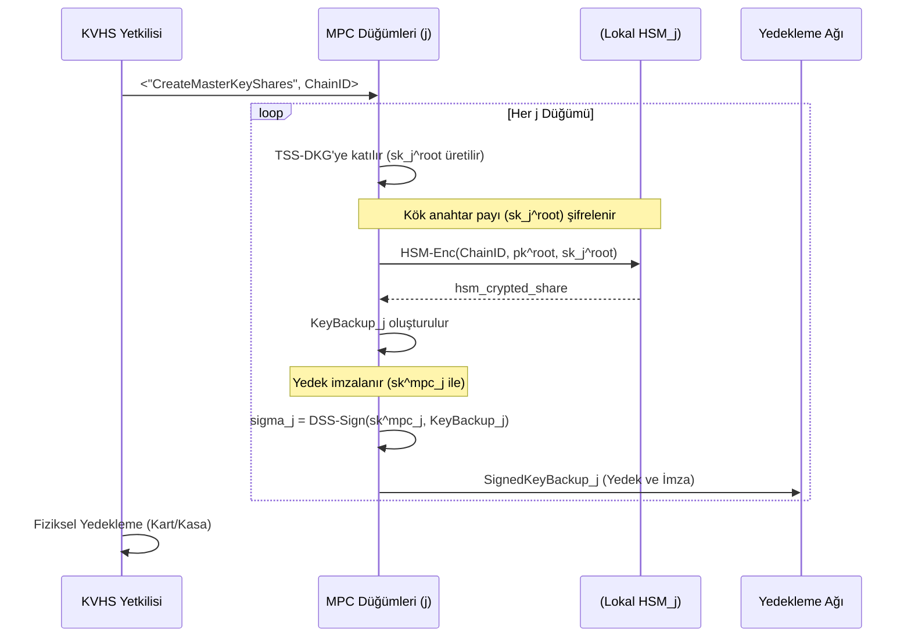
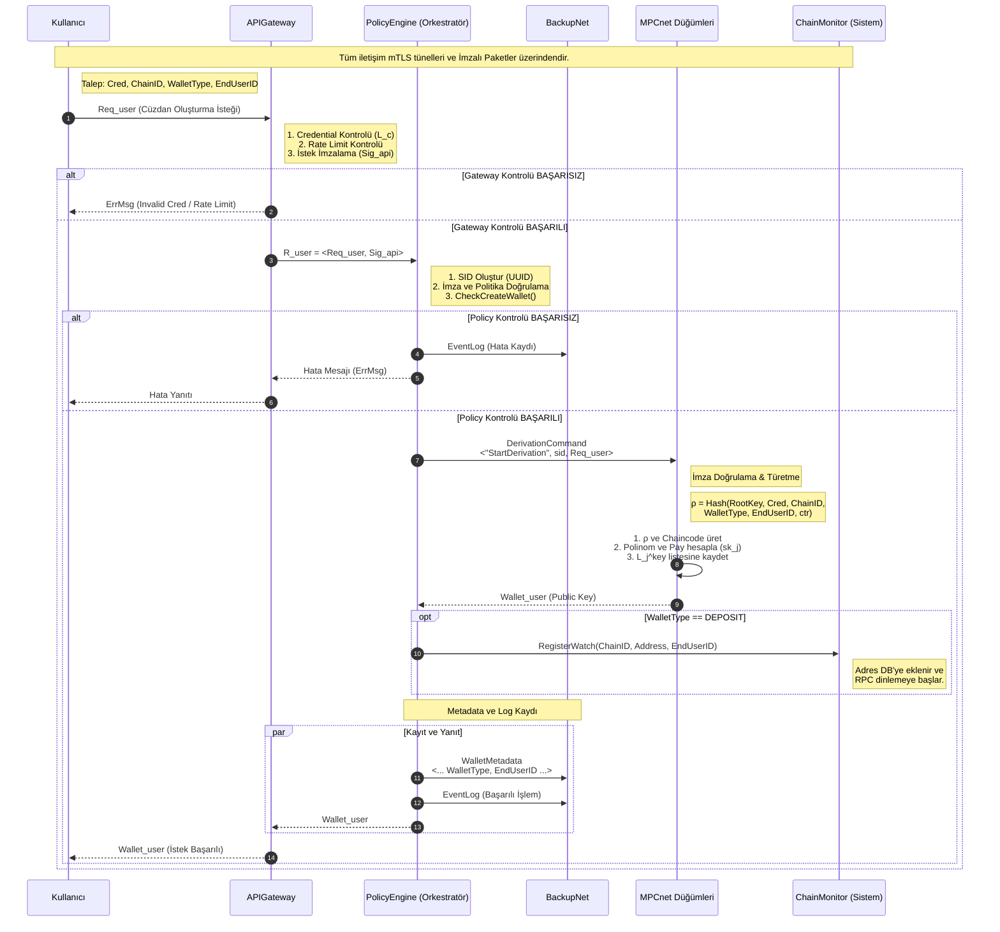
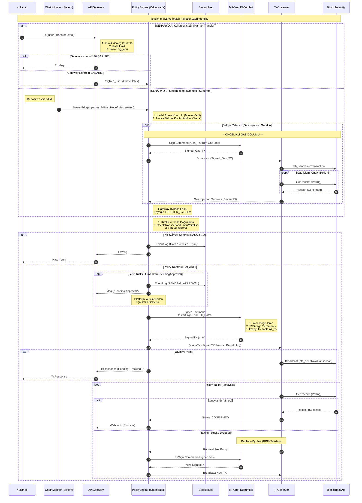
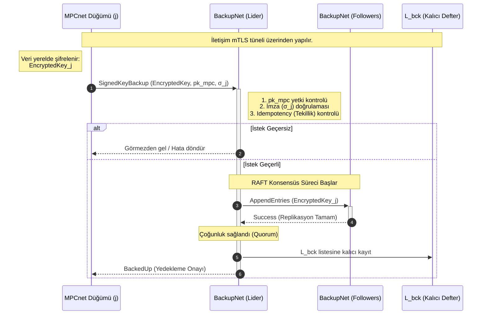
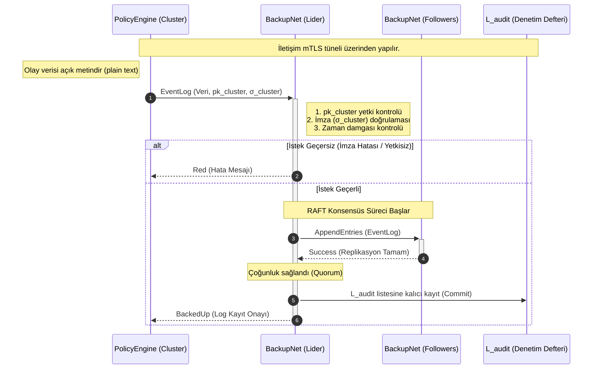
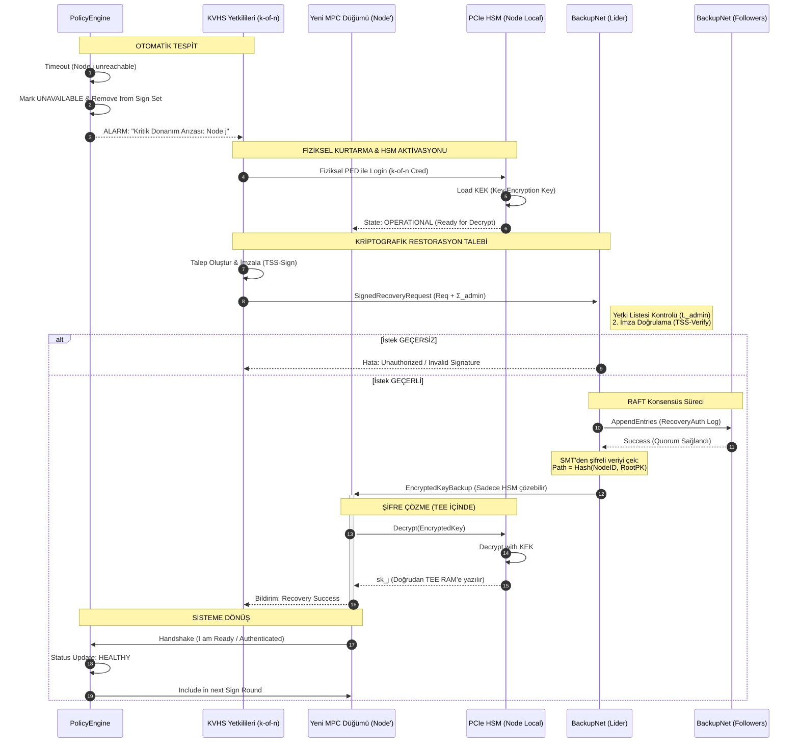
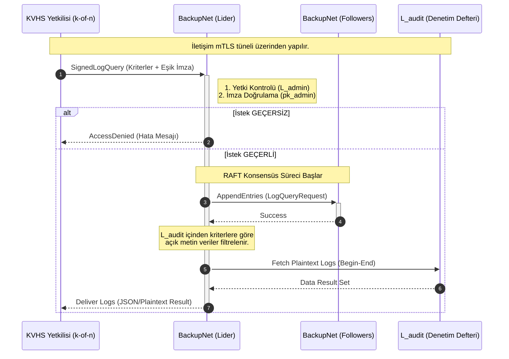

# TORCUS: Dijital Varlıklar İçin Yeni Nesil MPC Altyapısı

# ÖZ

Modern kripto varlık saklama süreçlerinde güvenlik, operasyonel hız ve mevzuat uyumu arasındaki denge kritik önem taşımaktadır. Sunulan protokol, özel anahtarları hiçbir zaman tek bir fiziksel noktada oluşturmadan veya birleştirmeden saklayan, MPC tabanlı dağıtık bir cüzdan altyapısıdır. Protokolün temel farkı, donanımsal izolasyon (TEE) ile fiziksel korumayı (HSM) entegre ederek hem siber saldırılara hem de iç tehditlere karşı çok katmanlı bir savunma hattı oluşturmasıdır. SPK ve TÜBİTAK kriterleri gözetilerek tasarlanan mimari; yüksek riskli işlemlerde manuel onay süreçlerini, düğüm arızalarına karşı otomatik yedekten kurtarma mekanizmasını ve kurumsal politikaların kriptografik olarak denetlenmesini içerir. Bu altyapı, KVHS'lerin varlık güvenliğini matematiksel kesinlikle sağlarken, yasal uyum süreçlerini "Tasarım Yoluyla Güvenlik" prensibiyle basitleştirir.

# Giriş: **Yeni Nesil Dağıtık Dijital Varlık Saklama Protokolü**

Kripto Varlık Hizmet Sağlayıcıları (KVHS) için dijital varlıkların saklanması, sadece bir "şifreleme" meselesi olmaktan çıkmış; operasyonel hız, siber dayanıklılık ve regülatif şeffaflığın kesiştiği çok boyutlu bir güvenlik mühendisliği sorunu haline gelmiştir. Geleneksel cüzdan mimarileri (Donanım cüzdanları, soğuk depolama vb.), varlıkların güvenliğini tek bir "özel anahtar" veya "tohum" (seed) öbeğine indirgeyerek **Tek-Hata-Noktası (Single Point of Failure - SPOF)** riskini doğurur. Bu modelde anahtarın ifşası varlıkların kaybına, anahtarın erişilemezliği ise sistemin felç olmasına yol açar.

Türkiye'de SPK ve TÜBİTAK tarafından belirlenen "Bilgi Sistemleri ve Teknolojik Altyapı Kriterleri", bu risklerin yönetilmesi için konvansiyonel yöntemlerin ötesinde bir güvenlik güvencesi talep etmektedir. Mevzuat; anahtar yönetiminin paylaştırılmasını, kritik yazılımların donanımsal izolasyonunu (HSM/TEE) ve her işlemin değiştirilemez bir denetim izine (Audit Trail) bağlanmasını zorunlu kılmaktadır.

Bu doküman, söz konusu regülatif standartları **"Security by Design" (Tasarım Yoluyla Güvenlik)** ilkesiyle karşılayan, $(t, n)$-Eşik İmza Şeması (TSS) tabanlı, ileri seviye bir Çok Taraflı Hesaplama (MPC) protokolünün teknik spesifikasyonudur.

Sunulan protokol, geleneksel modellerden farklı olarak dört temel teknolojik sütun üzerine inşa edilmiştir:

1. **Dağıtık Güven (MPCnet):** Kök anahtarlar hiçbir zaman tek bir fiziksel veya mantıksal birimde oluşmaz. Anahtar üretimi ve imzalama süreçleri, birbirine güvenmeyen ancak matematiksel olarak işbirliği yapan bir düğüm ağı tarafından yürütülür.

2. **Kriptografik Politika Orkestrasyonu (PolicyEngine):** İdari kurallar ve limitler, kriptografik icradan izole edilmiştir. **TEE (Trusted Execution Environment)** içinde çalışan politika motoru, her işlemi imzalama öncesinde denetler ve idari onayları (Manual Approval) TSS tabanlı dijital mühürlerle doğrular.

3. **Dayanıklı ve Doğrulanabilir Yedekleme (BackupNet):** Sistem, operasyonel arızalara karşı **RAFT konsensüsü** ve **Sparse Merkle Tree (SMT)** veri yapısını kullanan, şifreli (sadece anahtar yedekleri) ve deterministik bir yedekleme katmanıyla korunur.

4. **Hibrit Güvenlik Modeli:** Düğümler, anahtar paylarını saklamak için **HSM (Hardware Security Module)**, karmaşık protokol mantığını yürütmek için ise **TEE** teknolojilerini birleştiren hibrit bir koruma kalkanı kullanır.

Bu çalışma; cüzdan oluşturulmasından felaket kurtarma senaryolarına, manuel onay mekanizmalarından politika güncellemelerine kadar tüm yaşam döngüsünü kapsayan, TÜBİTAK kriterleriyle tam uyumlu, modüler ve yüksek performanslı bir saklama altyapısını tanımlamaktadır.

## Protokole genel bakış

Bu protokol, "Sorumlulukların Ayrılması" ilkesine dayanan, **dört** ana icra katmanı ve bir dağıtık yedekleme katmanından oluşan bir mimari üzerine kuruludur.

1. $\texttt{APIGateway}$ **(İletim Katmanı):** Sistemin dış dünyaya açık kapısıdır. Kullanıcı taleplerini karşılar, TLS tünelleri kurar, yük dengeleme ve Kimlik Doğrulama yapar. Talepleri politika denetimi için $\texttt{PolicyEngine}$’e imzalı olarak iletir.
2. $\texttt{ChainMonitor}$ **(Zincir İzleme ve Tetikleme):** Sistemin blokzincir ağlarına bakan gözüdür. Platform müşterilerinin yatırma adreslerini izler, gelen fonları tespit eder ve $\texttt{APIGateway}$'den bağımsız olarak $\texttt{PolicyEngine}$'e güvenli iç ağ üzerinden "Süpürme Tetikleyicileri" gönderir.
3. $\texttt{PolicyEngine}$ **(Merkezi Karar ve Orkestrasyon):** TEE içinde çalışan ve Raft konsensüsü ile yönetilen kümedir. İşlem limitlerini, whitelist kurallarını ve süpürme hedeflerini denetler. Onaylanan işlemler için $\texttt{MPCnet}$'e imzalı komutlar gönderir.
4. $\texttt{MPCnet}$ **(Kriptografik İcra Katmanı):** Dağıtık TSS operasyonlarını yürüten TEE içinde çalışan düğüm ağıdır. Sadece $\texttt{PolicyEngine}$'den gelen doğrulanmış komutları icra eder.
5. $\texttt{BackupNet}$ **(Dağıtık Yedekleme ve Denetim):** Anahtar paylarını ve olay günlüklerini saklayan katmandır.

### **Anahtar yönetimi ve yedekleme stratejisi**

Protokol, hiyerarşik bir anahtar yönetim modeli (Threshold HD Wallet) kullanır:

- **L1 (Sistem Kök Anahtarı):** KVHS yetkilileri gözetiminde $\texttt{TSS-DKG}$ ile üretilen paylardır.
    - **Operasyonel Yedekleme:** Paylar HSM ile şifrelenerek $\texttt{BackupNet}$'e gönderilir; kurtarma işlemi ancak **KVHS yetkililerinin eşik onayıyla** başlatılabilir.
    - **Felaket Yedeği:** Paylar fiziksel akıllı kartlarda, canlı erişime kapalı kasalarda saklanır.
- **L2 (Kullanıcı Cüzdan Payları):** L2 (Cüzdan Payları ve Yatırma Adresleri): Her düğüm, kendi L1 payından deterministik yöntemlerle (non-hardened); hem bireysel kullanıcı cüzdanlarını hem de platform müşterilerine ait milyonlarca yatırma adresini (Deposit Addresses) türetir.

<aside>
⚠️

Güvenlik mimarisi gereği, Seviye-2 (L2) kullanıcı cüzdanlarına ait gizli anahtar payları ($sk_j^{ChainID,user,ctr}$) **asla** kalıcı diske yazılmaz ve şifreli dahi olsa $\texttt{BackupNet}$ üzerinde anahtar yedeği olarak tutulmaz. Bu paylar, saldırı yüzeyini minimize etmek amacıyla sadece $\texttt{MPCnet}$ düğümlerinin güvenli uçucu belleğinde (Volatile Memory/RAM) barındırılır.

Ancak, bir $\texttt{MPCnet}$ düğümünün yeniden başlatılması veya felaket kurtarma senaryosunda; bu uçucu payların, kalıcı L1 kök anahtar payından ($sk_j^{ChainID,root}$) deterministik olarak yeniden türetilebilmesi için, türetme sürecinde kullanılan parametrelerin (metadata) kaybolmaması hayati önem taşır. 

Bu sürekliliği sağlamak için, her başarılı cüzdan oluşturma işleminde aşağıdaki metadata yapısı oluşturulur:

$$
\texttt{WalletMetadata} = \langle pk^{ChainID,root},\texttt{Cred}_{\texttt{user}}, \texttt{ChainID}, ctr\rangle
$$

Bu yapı, gizli anahtar verisi içermez ancak cüzdanın "kimliğini" tanımlar. $\texttt{PolicyEngine}$ bu veriyi $\texttt{BackupNet}$ üzerindeki global cüzdan kütüğüne ($\mathcal{L}^{meta}$) kaydeder.

**Kurtarma Prosedürü:**

Bir $\texttt{Node}^{\texttt{MPC}}_j$ yeniden başlatıldığında şu adımları izler:

1. **L1 Yükleme:** $\texttt{HSM}_j$ ile güvenli el sıkışma yaparak L1 kök anahtar payını ($sk_j^{ChainID,root}$) güvenli belleğe (TEE RAM) yükler.
2. **Metadata Senkronizasyonu:** $\texttt{BackupNet}$ üzerinden güncel $\mathcal{L}^{meta}$ listesini çeker.
3. **L2 Yeniden İnşa:** Listedeki her bir $\texttt{WalletMetadata}$ kaydı için; $pk^{ChainID,root}$ ve $ctr$ değerlerini kullanarak türetme algoritmasını yerelde tekrar çalıştırır.
4. Hesaplanan $sk_j^{ChainID,user,ctr}$ değerlerini yerel $\mathcal{L}^{key}_j$ listesine ekler ve düğüm operasyonel hale gelir.
</aside>

<aside>
⚠️

Hiçbir zaman kullanıcının tam özel anahtarı (full private key) oluşmaz; lokalde saklananlar sadece o düğüme ait matematiksel paylardır. Bu paylar, operasyonel hız için hafızada tutulur ancak L1 payından her an yeniden türetilebildikleri için ayrıca yedeklenmezler.

</aside>

Bu katmanlı yedekleme stratejisi kritiktir: Rutin bir operasyonel arıza (bir $\texttt{MPCnet}$ düğümünün çökmesi) durumunda, sistem $\texttt{BackupNet}$ üzerinden **(L1 yedeğini)** kurtarır. Kurtarılan bu L1 kök anahtar payı kullanılarak, o düğüme ait tüm L2 anahtar payları deterministik olarak yeniden hesaplanabilir. 

### **Kimlik doğrulama ekipman standartları**

Protokol kapsamında tanımlanan kritik işlemleri (Politika onayı, para transferi, kural değişikliği) imzalayan yetkililerin ($sk^{admin}$ ve $sk_{user}$ sahipleri) kimlik doğrulama süreçleri, **TÜBİTAK Kriterleri Madde 11** ve atıfta bulunduğu **Madde 6** uyarınca aşağıdaki sertifikalı donanımlar ve yöntemlerle gerçekleştirilir:

1. **Donanım Tabanlı Kimlik Doğrulama (FIPS/CC):** KVHS yetkililerine ve Platform Yöneticilerine tahsis edilen yetki anahtarları ($sk_j$), standart disklerde veya dosya sistemlerinde saklanmaz.
    - **Standart:** Kullanılan donanım tokenları (Security Keys / Smart Cards), **FIPS 140-2/3 Level 2+** veya **Common Criteria EAL4+** güvenlik sertifikasına sahiptir.
    - **Anahtar izolasyonu:** Özel anahtarlar ($sk_j$), bu donanımların "secure element" yongası içinde üretilir ve dışarı çıkarılmasına (export) teknik olarak izin verilmez.
    - **Etkileşim:** İmzalama işlemi sırasında, yetkilinin fiziksel varlığını kanıtlayan **PIN girişi** ve **fiziksel temas (capacitive touch)** zorunludur.
2. **Mobil Cihaz ve MDM Entegrasyonu:** Yetkililerin kimlik doğrulama veya ikinci faktör (2FA) aracı olarak kurumsal mobil cihazları kullanması durumunda:
    - İlgili mobil cihazlar, KVHS’nın merkezi **Mobil Cihaz Yönetimi (MDM)** sistemine kayıtlıdır.
    - MDM politikaları, cihazın "Jailbreak/Root" edilmediğini, işletim sisteminin güncel olduğunu ve ekran kilidi güvenliğini sürekli denetler. Güvenliği ihlal edilmiş cihazlardan gelen imza talepleri $\texttt{APIGateway}$ seviyesinde reddedilir.
    
    <aside>
    💡
    
    **MEVZUAT UYUMLULUĞU: MOBİL CİHAZ GÜVENLİĞİ (MADDE 11.2)**
    Bu protokolde tanımlanan **Mobil Cihaz Yönetimi (MDM)** entegrasyonu ve $\texttt{APIGateway}$ doğrulama süreçleri, **TÜBİTAK Kriterleri Madde 11.2** ve alt bentlerinde belirtilen şartları aşağıdaki teknik yeteneklerle karşılamaktadır:
    
    - **Uzaktan Sıfırlama (Madde 11.2.a):** Entegre MDM çözümü, kayıp/çalıntı durumunda cihazdaki kriptografik anahtarları ve uygulamayı uzaktan silme (Remote Wipe) yetkisine sahiptir.
    - **Uygulama Kısıtlaması (Madde 11.2.b):** Cihazlar "Yönetilen Profil" (Work Profile) veya "Kiosk Modu"nda çalıştırılarak, sadece KVHS tarafından imzalanmış ve onaylanmış yetkili uygulamanın yüklenmesine teknik olarak izin verilir.
    - **Zararlı Yazılım ve Bütünlük Kontrolü (Madde 11.2.c):** Uygulama, çalışma zamanında (Runtime) cihazın "Root/Jailbreak" durumunu ve işletim sistemi bütünlüğünü (Attestation) denetler; riskli cihazlarda anahtar kullanımını donanımsal olarak engeller.
    - **Sunucu Taraflı 2FA Doğrulaması (Madde 11.2.ç):** $\texttt{APIGateway}$, mobil cihazdan gelen her imza paketini doğrular. İlgili anahtarın ($sk_{client}$) donanımsal olarak sadece biyometrik/PIN doğrulaması (2. Faktör) sonrası imza üretebildiği "Secure Enclave" teknolojisi ile garanti altına alındığından; geçerli bir imzanın varlığı, sunucu tarafında 2FA'nın yapıldığının matematiksel kanıtı olarak kabul edilir.
    </aside>
    

**Kriptografik Yaşam Döngüsü ve Yetki Yönetimi**

Sistem güvenliğinin sürekliliğini sağlamak amacıyla, kriptografik anahtarlar ve yetkili kimlikleri dinamik bir yaşam döngüsü içinde yönetilir:

- **Güncelleme (Key Refresh):** Tasarımda $\texttt{MPCnet}$ için "Key Refresh" mekanizması ile kriptografik kimlik bilgileri periyodik olarak güncellenmektedir. Bu süreç, tanımlı açık anahtarın ($pk$) kendisini değiştirmeden, gizli anahtar parçalarının ($sk_j$) tamamını yenileyerek olası sızıntı risklerini elimine eder.
- **İptal (Revocation):** İlgili yetkilinin değişmesi, görevden ayrılması veya yetkisinin sonlanması durumunda; o yetkiliye ait dijital sertifika ve anahtarlar derhal iptal edilerek **Sertifika İptal Listesi'ne (CRL - Certificate Revocation List)** alınır. $\texttt{APIGateway}$ ve $\texttt{PolicyEngine}$, her işlem öncesinde bu listeyi kontrol ederek yetkisi iptal edilmiş kişilerin sisteme erişimini engeller.

# Temel kavramlar

Bu protokolün teknik detaylarına geçmeden önce, sistemi oluşturan temel bileşenler, taraflar, kullanılan kriptografik anahtarlar ve mesaj yapıları bu bölümde tanımlanmıştır. Ayrıca, protokolün dayandığı alt protokollerin (örn. $\texttt{TSS}$) ve kullanılan kriptografik yapıların formal tanımları da bu bölümde verilmiştir. Takip eden "Notasyon ve Terimler" bölümü, protokolün formel dilini anlamak için bir sözlük niteliğindedir.

## Notasyon ve terimler

Bu bölümde, protokol metninde kullanılan notasyon ve terimler açıklanmaktadır.

### Taraflar ve sistem bileşenleri

$\texttt{User}$: Sistemde yeni bir MPC cüzdanı oluşturmak veya işlem imzalamak isteyen, kimliği doğrulanmış yetkili taraf. Bu terim, mevzuat uyumluluğu kapsamında iki farklı müşteri profilini de kapsar:

- Kendi nam ve hesabına işlem yapan gerçek/tüzel müşteriler,
- Kendi kullanıcıları adına toplu işlem yapan platform tipi müşteriler.

$\texttt{APIGateway}$**:** Kullanıcıdan ($\texttt{User}$) gelen tüm istekler için mantıksal tek giriş noktası (logical entry-point) olarak görev yapan koordinasyon katmanıdır. Tek bir hata noktası (SPOF) olmasını engellemek ve yüksek erişilebilirlik sağlamak amacıyla, bu katman bir yük dengeleyici (load balancer) arkasında çalışan birden fazla sunucudan (sunucu havuzu) oluşur. Bu bileşen, kriptografik seremonilere ($\texttt{TSS-DKG}$, $\texttt{TSS-Sign}$) katılmaz ve hiçbir gizli anahtar payı $(sk^{\texttt{user}}_j)$ tutmaz. Temel sorumluluğu i**lk seviye doğrulama**dır.  Hız sınırlaması (rate limiting) yapar. **Kullanıcı ile güvenli tünel oluşturur.** Bu katman, iş kuralı (limit, whitelist vb.) denetimi yapmaz. İletişime geçtiği kullanıcıdan aldığı işlem talebini $\texttt{PolicyEngine}$'e iletir. 

$\texttt{PolicyEngine}$: Merkezi Politika Motoru; $\texttt{APIGateway}$ katmanından gelen işlem taleplerini, kriptografik işlem ($\texttt{TSS-Sign}$ vs.) başlamadan **önce** inceleyen, bu talebin geldiği kulanıcının kimlik bilglierinin geçerli oluduğunu, bu taleplerin kurumun risk politikalarına, müşteri sözleşmelerine ve ilgili mevzuata (SPK Tebliğleri, MASAK vb.) uygunluğunu deterministik olarak denetleyen **ve uygun olmayan talepleri kesin olarak engelleyen mekanizmadır.** Merkezi Politika Motoru'nun kural seti (Rule Set), SPK Tebliğleri ve Kurul kararlarındaki değişikliklere paralel olarak, sadece yetkili KVHS personeli tarafından 'Yazma/Güncelleme' yetkisiyle güncellenebilir yapıdadır. Regülasyon kapsamında **"Kritik Yazılım"** sınıfında yer almaktadır. Bu bileşen, TEE içinde çalışan ve Raft konsensüsü ile senkronize olan sunuculardan oluşan bir kümedir (Cluster). Tüm kararları (Onay/Ret) $\texttt{BackupNet}$'e loglar ve onaylanan işlemler için **İcra Yetki Belgesi (**$\texttt{AuthToken}$**)** imzalayarak $\texttt{MPCnet}$ düğümlerine gönderir. 

$\texttt{TxObserver}$**: (İşlem Gözlemcisi):** $\texttt{PolicyEngine}$ kümesine entegre çalışan, $\texttt{MPCnet}$ tarafından imzalanmış ham işlemleri blokzincir ağlarına yayınlayan (broadcasting) ve yayınlanan işlemlerin durumunu (Confirmation, Dropped, Pending) mempool seviyesinde takip eden modüldür. İşlemlerin ağda takılması durumunda, RBF (Replace-By-Fee) politikalarını tetikleyerek işlemin kesinleşmesini (finality) garanti altına alır.

$\texttt{ChainMonitor}$ **(Zincir İzleyicisi):** Platform tipi müşterilerin "Yatırma Adreslerini" (Deposit Addresses) blokzincir düğümleri (RPC) üzerinden sürekli dinleyen iç servistir. Gelen varlıkları tespit ettiğinde, $\texttt{APIGateway}$'den bağımsız güvenli bir iç kanal üzerinden $\texttt{PolicyEngine}$'e "Süpürme" (Sweep) emri gönderir.

$\texttt{MPCnet}$: Çok Taraflı Hesaplama (Multi-Party Computation) işlemlerini yürüten, her biri güvenli alanda (TEE) çalışan dağıtık düğümlerden oluşan ana ağ. **Regülasyonun EAL4 seviyesinde zorunlu kıldığı "kritik yazılım" bileşeni olan Merkezi Politika Motoru'nu *(***$\texttt{PolicyEngine}$***)* da barındırır.** $\texttt{APIGateway}$'den gelen talep alındığında, önce bu talebi $\texttt{PolicyEngine}$ aracılığı ile sorgular ve sadece onay alırsa kriptografik işlemleri (anahtar üretme, imzalama) yürütür. Ağa dahil olan veya HSM ile iletişim kuran her MPC düğümü, çalıştığı donanımın ve yazılımın bütünlüğünü kanıtlamak zorundadır. Bunun için donanım üreticisi (Intel/AWS) tarafından imzalanmış u**zaktan tasdik (remote attestation)** raporları kullanılır. Bu rapor doğrulanmadan düğüme hiçbir anahtar parçası gönderilmez.

$\texttt{BackupNet}$: $\texttt{MPCnet}$ düğümlerinin anahtar paylarını ve $\texttt{PolicyEngine}$’in karar kayıtlarının güvenli bir şekilde yedeklediği dağıtık düğümlerden oluşan başka bir ağ. $\texttt{BackupNet}$ üzerinde tutulan tüm operasyonel kayıtlar ve sistem logları; bağımsız bilgi güvenliği denetçilerinin incelemesine imkan verecek şekilde tasarlanmıştır. Bu kayıtlar, kriptografik zaman damgası (timestamp) ve konsensüs yapısıyla bütünlüğü korunmuş olup; denetim sırasında anahtar mahremiyetini ihlal etmeden (özel anahtarlar hariç tutularak) süreçlerin doğruluğunu kanıtlar niteliktedir.

### Kriptografik anahtarlar ve imzalar

$\texttt{Node}^{\texttt{MPC}}_i$: $\texttt{MPCnet}$ ağına dahil olan $i$’nci düğüm. 

$\texttt{Node}^{\texttt{Backup}}_j$: $\texttt{BackupNet}$ ağına dahil olan $j$’nci düğüm.

$sk_{client}$: Kullanıcının cihazındaki Güvenli Bölge'de (Secure Enclave) donanımsal olarak saklanan, kullanıcının işlem niyetini kanıtlayan niyet imzalama anahtarı. (MPC cüzdan anahtarından farklıdır).

$pk_{client}$: Kullanıcının sisteme kayıt (onboarding) sırasında tanımladığı, $sk_{client}$ ile atılan niyet imzalarını doğrulamak için $\texttt{PolicyEngine}$ veritabanında saklanan açık anahtar.

$sk_j^{admin}$: $\mathcal{N}$ yetkili kümesindeki $j$’nci KVHS yetkilisi tarafından tutulan, $sk^{admin}$ ortak gizli anahtarının bireysel payı. Bu pay, yetkilinin **güvenli imzalama donanımında** izole edilir.

$pk^{admin}$: Politika motorunun kural setine ait güncelleme mesajlarının ($\texttt{PolicyUpdateBody}$) doğru yetkili küme tarafından onaylandığını doğrulamak için kullanılan ortak açık anahtar.

$sk^{\texttt{API}}_j$: $\texttt{APIGateway}$’deki $j$’nci sunucunun gizli anahtarı. Kullanıcı talebini $\texttt{PolicyEngine}$’e gönderirken imzalamak için kullanılır.

$pk^{\texttt{API}}_j$: $\texttt{APIGateway}$’deki $j$’nci sunucunun açık anahtarı. $sk^{\texttt{API}}_j$ ile atılan imzaları doğrulamak için kullanılır.

$sk^{\texttt{Cluster}}_j$: $\texttt{PolicyEngine}$ kümesindeki $j$’nci sunucunun gizli anahtarı. Kriptografik işlem emrini $\texttt{MPCNet}$’e gönderirken imzalamak için kullanılır.

$pk^{\texttt{Cluster}}_j$: $\texttt{PolicyEngine}$ kümesindeki $j$’nci sunucunun açık anahtarı. $sk^{\texttt{Cluster}}_j$ ile atılan imzaları doğrulamak için kullanılır.
$sk^{mpc}_j$*:* $\texttt{Node}^{\texttt{MPC}}_j$ *düğümünün kendisine ait gizli imzalama anahtarı. Düğüm, kendi ürettiği mesajları (örneğin anahtar yedeğini) bu anahtarla imzalar.*

$pk^{mpc}_j$*:* $\texttt{Node}^{\texttt{MPC}}_j$ *düğümünün kendisine ait açık anahtarı. Düğümün attığı imzaları doğrulamakta kullanılır.*

$sk_j^{ChainID,root}$: $\texttt{ChainID}$ için oluşturulan **L1 (Kök)** gizli anahtarının $j$ düğümünde tutulan payı.

$pk^{ChainID,root}$: "Kriptografik İlklendirme" (TSS-DKG) seremonisi sonucunda $\texttt{ChainID}$ için oluşturulan **L1 (Kök)** açık anahtarı.

$sk_j^{ChainID,user,ctr}$: L1'den türetilen **Seviye-2 (L2)** gizli anahtarının $j$ düğümünde tutulan payı.

$pk^{ChainID,user,ctr}$: L1'den türetilen **L2 (kullanıcı cüzdanı)** açık anahtarı. Bu, kullanıcının cüzdan adresiyle ilişkilidir.

$sk_k^{bck}$: $\texttt{Node}^{\texttt{Backup}}_k$ düğümünün kendisine ait gizli imzalama anahtarı (konsensüs için)

$pk_k^{bck}$: $\texttt{Node}^{\texttt{Backup}}_k$ düğümünün kendisine ait açık anahtarı (konsensüs için)

### Mesajlar ve veri yapıları

$\texttt{R}_{\texttt{user}}$: 

$\texttt{Req}_{\texttt{user}}$: Kullanıcının cüzdan oluşturma talebini içeren **imzalı paket.** $\langle \texttt{CreateWalletPayload}, \sigma_{client} \rangle$ ikilisinden oluşur. İçerik şudur: $\langle \text{“CreateMPCWallet”}, \texttt{Cred}_{\texttt{user}}, \texttt{ChainID}, \mathbf{\texttt{WalletType}}, \mathbf{\texttt{EndUserID}}\rangle$

$\texttt{SweepReq}$: $\texttt{ChainMonitor}$ tarafından oluşturulan, $\texttt{PolicyEngine}$'e gönderilen otomatik süpürme isteği. $\langle \text{“AutoSweep”}, \texttt{SourceAddr}, \texttt{Amount}, \texttt{AssetID}, \texttt{Target:Omnibus} \rangle$ demetinden oluşur.

$\texttt{ErrMsg}$*: Protokol sırasında bir hata oluştuğunda yayınlanan hata mesajı.*

$\texttt{EncryptedKey}$: Bir **L1 Kök Anahtar** payını ($sk_j^{root,ChainID}$) içeren ve HSM ile şifrelenmiş veri paketi.

$\texttt{SignedKeyBackup}_{j}$*:* $j$ düğümü tarafından imzalanmış ve $\texttt{BackupNet}$'e gönderilmeye hazır nihai **L1 kök anahtar** yedek mesajı.
**$\texttt{Wallet}_{\texttt{user}}$: Cüzdan oluşturma işlemi başarıyla tamamlandığında kullanıcıya gönderilen sonuç mesajı.

$\texttt{KeyBackup}_{j}$: $j$ düğümü tarafından oluşturulan ve L1 kök anahtar payını içeren şifreli yedek paketi.

$\texttt{SigReq}_{\texttt{user}}$*: Kullanıcının işlem imzalatmak için gönderdiği tam istek paketi.* $(\texttt{TX}_{\texttt{user}}, \sigma_{\texttt{user}}^{tx})$ ikilisinden oluşur.

$\texttt{TX}_{\texttt{user}}$: 

$\texttt{SignedTX}_{\texttt{user}}$: İşlem imzalama işlemi başarıyla tamamlandığında kullanıcıya gönderilen sonuç mesajı.

$\texttt{SignedRecoveryRequest}_j$: $\texttt{RecoveryRequest}_j$ mesajının $\texttt{Node}^{\texttt{MPC}}_j$ düğümü tarafından imzalanmış hali.

$\texttt{RecoveryRequest}_j$: $\texttt{Node}^{\texttt{MPC}}_j$ düğümünün L1 kök anahtar payını kurtarmak için gönderdiği imzasız, ham istek.

$\texttt{PolicyUpdateBody}$: Politika Motoru kural setini değiştirecek olan imzasız ham veri içeriğidir. **Yetkili personel onayı gerektiren her türlü idari kural değişikliğini** **temsil eder.** $\langle \text{``UpdatePolicy"}, \texttt{Cred}_{\texttt{PE}}, \texttt{RuleID}, \texttt{NewValue}\rangle$ demetinden oluşmaktadır.

$\texttt{QueryParam}$ **(Denetim parametreleri):** Olay günlüklerini sorgulamak için kullanılan parametre seti. $\langle \texttt{FilterType}, \texttt{StartValue}, \texttt{EndValue}, \texttt{Cred}_{\texttt{user}}, \mathbf{\texttt{EndUserID}} \rangle$ demetinden oluşmaktadır. 

$\texttt{RegisterWatch}$**:** $\texttt{PolicyEngine}$ tarafından $\texttt{ChainMonitor}$'a gönderilen, yeni üretilen bir deposit adresinin izleme listesine alınması emridir. $\langle \text{“Watch”}, \texttt{ChainID}, \texttt{Address}, \texttt{EndUserID} \rangle$ demetinden oluşur. 

$\texttt{ScheduleReq}$**:** 

### Listeler (veri kayıtları)

$\mathcal{L}^{c}$*:  Sisteme kayıtlı ve geçerli kullanıcı kimlik bilgilerini* $(\texttt{Cred}_{\texttt{user}})$ *içeren liste.*

$\mathcal{L}^{key}_{j}$: $\texttt{Node}^{\texttt{MPC}}_j$ düğümünün, türetilen **L2 (Cüzdan)** gizli anahtar paylarını ($sk_j^{ChainID,user,ctr}$) kaydettiği yerel liste.

$\mathcal{L}^{backup}_{pk}$: $\texttt{BackupNet}$’in tanıdığı ve yedekleme yapmaya yetkili olan $\texttt{MPCnet}$ düğümlerinin açık anahtarlarını $(pk^{mpc}_j)$ içeren liste.

$\mathcal{L}^{backup}_{bck}$: $\texttt{BackupNet}$ ağındaki tüm düğümler tarafından tutulan $\texttt{MPCnet}$ düğümlerinin  şifrelenmiş L1 kök anahtar yedeklerinin $(\texttt{KeyBackup}_{j})$ tutulduğu liste.

$\mathcal{L}^{watch}$**:** $\texttt{ChainMonitor}$ servisi tarafından tutulan ve blokzincir ağı üzerinde anlık olarak dinlenen; $\langle \texttt{ChainID}, \texttt{Address}, \texttt{EndUserID} \rangle$ üçlülerinden oluşan aktif izleme listesi.

$\mathcal{L}^{track}$ **(Takip Listesi):** $\texttt{TxObserver}$ servisi tarafından yönetilen; ağa yayınlanmış ancak henüz blokzincir üzerinde kesinleşmemiş (Pending) işlemleri ve onların yaşam döngüsü durumlarını (Nonce, LastGasPrice, RetryCount) tutan dinamik liste.

### Veri elemanları ve tanımlayıcılar

$\texttt{Cred}_{\texttt{user}}$*: Kullanıcının sistemdeki kimliğini belirten bilgiler (kullanıcı adı, ID, vb.).*

$\texttt{ChainID}$*: Cüzdanın hangi blokzincir ağı (örn. Ethereum, Bitcoin) için oluşturulduğunu belirten kimlik.*

$\texttt{sid}$*: Her işlem için üretilen benzersiz Oturum Kimliği (Session ID).*

$\texttt{TXBody}$: Kullanıcı tarafından imzalanması istenen, blokzincire özel ham işlem verisi (örn. kime, ne kadar, gaz ücreti vb.).

$\texttt{TS}_{api}$: Kullanıcıdan talebin alındığı zamanı gösteren zaman damgası

$\texttt{TS}_{bck}$: Yedekleme ağının veriyi kaydettiği zaman damgası

$\texttt{WalletType}$**:** Oluşturulacak cüzdanın davranış modelini belirleyen bayrak (flag). İki değer alabilir: $\texttt{PERSONAL}$ (Bireysel, süpürme yok) veya $\texttt{DEPOSIT}$ (Platform, otomatik süpürme var).

$\texttt{EndUserID}$**:** Platform tipi müşterilerin (Borsa), cüzdanı tahsis ettiği kendi son kullanıcısına ait tekil kimlik numarası (Customer ID). Bireysel cüzdanlar için $\texttt{NULL}$ değerini alır.

## Alt protokoller ve kriptografik yapılar

### Dijital imza şeması (Digital Signature Scheme - DSS)

Bir dijital imza şeması, bir mesajın bütünlüğünü ve göndericisinin kimliğini doğrulamak için kullanılan asimetrik kriptografi tabanlı bir yöntemdir. Şema, aşağıdaki üç polinom zamanlı algoritmadan oluşur:

1. $\texttt{DSS-KeyGen} (1^\lambda) \to (sk, pk)$: 
    
    Bu algoritma, güvenlik parametresi $\lambda$'yı girdi olarak alır. Bir gizli anahtar $sk$ (imzalama anahtarı) ve buna karşılık gelen bir açık anahtar $pk$ (doğrulama anahtarı) içeren bir anahtar çifti $(sk, pk)$ döndürür.
    
2. $\texttt{DSS-Sign}(sk, m) \to \sigma$: 
    
    Bu algoritma, bir gizli anahtar $sk$ ve bir mesaj $m$'i girdi olarak alır. Mesaja ait dijital imza olan $\sigma$'yı döndürür.
    
3. $\texttt{DSS-Verify}(pk, m, \sigma) \to \{0, 1\}$: Bu algoritma, bir açık anahtar $pk$, bir mesaj $m$ ve bir imza $\sigma$'yı girdi olarak alır. Eğer imza mesaj için geçerli ise $\texttt{1}$ (kabul), aksi takdirde $\texttt{0}$ (ret) döndürür.

### Eşik imza şeması (Threshold Signature Scheme - TSS)

Bir $(t, n)$ Eşik İmza Şeması, bir imzalama anahtarını $n$ katılımcıya dağıtarak tek bir tarafın imza yetkisini tek başına elinde tutmasını engelleyen bir dijital imza protokolüdür. Geçerli bir imza oluşturmak için en az $t$ katılımcının iş birliği yapması gerekir.

Şema, aşağıdaki dört polinom zamanlı  algoritmadan oluşur. İmzalama sürecinin dağıtık doğası nedeniyle $\texttt{DSS-Sign}$ işlemi burada iki adıma ayrılmıştır: $\texttt{TSS-PartialSign}$ ve $\texttt{TSS-Combine}$.

1. $\texttt{TSS-DKG}(1^\lambda, t, n) \to (pk, \{sk_1, \dots, sk_n\})$:
Bu (genellikle interaktif) algoritma, güvenlik parametresi $\lambda$, eşik değeri $t$ ve katılımcı sayısı $n$'i girdi olarak alır. Bir adet ortak açık anahtar $pk$ (doğrulama anahtarı) ve her bir $i$ katılımcısı için bir gizli anahtar payı $sk_i$ (imzalama anahtarı payı) döndürür.
    
    <aside>
    ⚠️
    
    İmzalama anahtarı $sk$ hiçbir zaman tek bir yerde birleştirilmez.
    
    </aside>
    
2. $\texttt{TSS-Sign}(t, \{sk_k\}_{k \in \mathcal{S}}, m) \to \sigma$: Bu  interaktif algoritma, eşik değeri $t$, gizli anahtar payları $\{sk_k\}_{k \in \mathcal{S}}$ ve $m$ mesajını girdi olarak alır. Bir adet imza döndürür. Burada $\mathcal{S}$ en az $t$ katılımcının indislerinin kümesidir. Bu algoritma aşağıdaki iki alt-algoritmadan oluşur:
    1. $\texttt{TSS-PartialSign}(sk_i, m) \to \sigma_i$:
    Bu algoritma, $i$ katılımcısının gizli anahtar payı $sk_i$ ve bir mesaj $m$'i girdi olarak alır. Mesaja ait bir kısmi imza (partial signature) olan $\sigma_i$'yı döndürür. 
        
        <aside>
        ⚠️
        
        Bu kısmi imza, tek başına geçerli bir dijital imza değildir.
        
        </aside>
        
    2. $\texttt{TSS-Combine} (\{\sigma_{k}\}_{k \in \mathcal{S}}) \to \sigma$:
    Bu algoritma, bir $m$ mesajına ait en az $t$ adet geçerli kısmi imzadan oluşan bir küme $\{\sigma_{k}\}_{k \in \mathcal{S}}$'yi girdi olarak alır. Tüm katılımcılar adına atılmış olan nihai ve geçerli dijital imza $\sigma$'yı döndürür. Eğer yeterli sayıda veya geçerli kısmi imza yoksa bir hata sembolü $(\perp)$ döndürür.
3. $\texttt{TSS-Verify}(pk, m, \sigma) \to \{0, 1\}$
Bu algoritma, standart bir dijital imza şemasındaki doğrulama algoritmasıyla aynıdır. Ortak açık anahtar $pk$, bir mesaj $m$ ve nihai bir imza $\sigma$'yı girdi olarak alır. Eğer imza mesaj için geçerli ise $\texttt{1}$ (kabul), aksi takdirde $\texttt{0}$ (ret) döndürür. 
    
    <aside>
    💡
    
    Doğrulayıcı taraf, imzanın tek bir kişi tarafından mı yoksa dağıtık bir süreçle mi oluşturulduğunu bilmek zorunda değildir.
    
    </aside>
    

### $\texttt{PolicyEngine}$ (Politika motoru)

1. $\texttt{PolicyEngine.CheckCreateWallet}(\texttt{Cred$_{\texttt{user}}$},\texttt{ChainID}) \to 0/1$
    1. Kullanıcının ($\texttt{Cred}_{\texttt{user}}$) ilgili zincir ($\texttt{ChainID}$) üzerinde yeni bir cüzdan oluşturma talebini kayıtlı kural setine göre kontrol eder.
2. $\texttt{PolicyEngine.CheckTransaction}(\texttt{TXBody}) \to =0/1/\texttt{PendingApproval}$
    1. İşlem içeriğini ($\texttt{TXBody}$) analiz ederek günlük limit, onaylı adres listesi (whitelist) veya ek yetkili onayı gibi kuralları denetler.
    2. Onaylar, iptal eder, veya manuel onay gerektiği durumlarda işlemi beklemeye alabilir. 

# Eşik cüzdan protokolü

Bu protokol, dijital varlıklar için çok yüksek güvenlikli, çok kilitli bir banka kasası gibi çalışan bir cüzdan sistemini tanımlar. Geleneksel cüzdanların aksine, bu kasayı açabilecek tek bir "anahtar" yoktur. Bunun yerine, bir cüzdan oluşturulduğunda, gizli anahtar kriptografik olarak parçalara ayrılır ve bu parçalar, her biri kendi güvenli donanımında (TEE) çalışan bir düğüm ağına dağıtılır. Bu düğümlerin hiçbiri, anahtarın tamamına tek başına sahip değildir ve anahtarın tamamı hiçbir zaman tek bir yerde birleştirilmez.

Bir işlem (örneğin para transferi **veya otomatik fon süpürme**) yapılmak istendiğinde, sistem "Sorumlulukların Ayrılması" ilkesine göre çalışan çok adımlı bir güvenlik kontrolü uygular. **Talepler sisteme iki farklı noktadan giriş yapar:**

1. **Manuel kullanıcı talepleri:** Sistemin dış kapısı olan $\texttt{APIGateway}$ üzerinden karşılanır.
2. **Otomatik sistem emirleri:** Zincir izleme servisi ($\texttt{ChainMonitor}$) tarafından, güvenli iç ağ üzerinden doğrudan iletilir.

Hangi kanaldan gelirse gelsin, tüm talepler nihai karar mekanizması olan $\texttt{PolicyEngine}$ servisinde toplanır.

$\texttt{APIGateway}$, bir talebi işleme almadan önce sadece ilk seviye kimlik doğrulama ve hız sınırlama kontrolünü merkezi olarak yürütür ve talebi sistemin karar mekanizması olan $\texttt{PolicyEngine}$ servisine iletir.

$\texttt{PolicyEngine}$ (Orkestratör), talebi devraldığında sistemin en kritik kontrollerini gerçekleştirir: "Kulanıcının kimliği geçerli mi?" , "İşlem tutarı günlük limiti aşıyor mu?", "Para, onaylanmış bir adrese (whitelist) mi gidiyor?" veya "Regülasyonun gerektirdiği ek yetkili onayları alındı mı?" gibi tüm kuralları denetler. Ancak bu denetimler başarıyla tamamlanırsa, $\texttt{PolicyEngine}$ çok taraflı hesaplama ağına ($\texttt{MPCnet}$) "imzala" komutunu göndererek süreci başlatır.

$\texttt{MPCnet}$ düğümleri, orkestratörden ($\texttt{PolicyEngine}$) gelen bu onaylı emri aldıklarında, kendi anahtar parçalarını kullanır ve tek bir geçerli imzayı ortaklaşa oluştururlar. Bu mimari, L1 (kök) anahtar parçalarının şifrelenerek ayrı bir yedekleme ağında ($\texttt{BackupNet}$) saklandığı ve bir düğümün (ya da tamamının) arızalanması durumunda güvenli bir şekilde kurtarılabildiği bir felaket kurtarma mekanizması ile daha da güçlendirilmiştir.

<aside>
⚠️

Sistem genelindeki tüm bileşenler ($\texttt{MPCnet}$ düğümleri, $\texttt{HSM}$ ve $\texttt{BackupNet}$) arasındaki veri trafiği, **TLS 1.3** protokolü ve **mTLS (Karşılıklı Kimlik Doğrulama)** mimarisi ile şifreli tüneller üzerinden sağlanır. Ayrıca, ağ trafiğinin geçmişe dönük çözülmesini engellemek (Perfect Forward Secrecy) amacıyla, **ECDHE** algoritması kullanılarak her oturum için geçici ve anlık anahtarlar üretilir; böylece iletişim güvenliği dinamik olarak korunur.

</aside>


Şekil 1: MPC Eşik Cüzdan Protokolü 

Tasarladığımız eşik cüzdan protokolünü on bölümde detaylandıracağız:

1. Sistem kurulumu ve kriptografik ilklendirme
2. Kullanıcı isteğinin alınması ve cüzdan oluşturulması
3. İşlem imzalama isteminin alınması, imzalanması ve takibi
4. Anahtar yedekleme
5. Olay günlüğü yedekleme
6. Düğüm çökmesi, denetim ve kurtarma
7. Yetkili imzası ile olay günlükleri sorgusu
8. $\texttt{PolicyEngine}$ kural seti ve yetki matrisi
9. KVHS Yetkililerince $\texttt{PolicyEngine}$ güncellemesi
10. Özel Durumlar

## Sistem kurulumu ve kriptografik ilklendirme

Bu bölüm, protokolün 'çalışma zamanı' (runtime) aşamasından önce, sistemin güvenli bir temel üzerine oturtulması için gereken 'tek seferlik' (one-time) kurulum ve hazırlık adımlarını detaylandırır. 

Bu kritik süreç, $\texttt{MPCnet}$ düğümlerinin her bir blokzincir ($\texttt{ChainID}$) için dağıtık anahtar üretme seremonisi ($\texttt{TSS-DKG}$) çalıştırmasını kapsar. Seremoni çıktısı olan kök anahtar payları ($\texttt{sk}_j^{root}$), yerel $\texttt{HSM}$'ler ile şifrelenir. Son olarak, bu şifreli yedekler imzalanarak $\texttt{BackupNet}$'e gönderilir ve ayrıca felaket kurtarma senaryolarına karşı fiziksel olarak da yedeklenir.

Bu diyagram, $\texttt{TSS-DKG}$'nin nasıl tetiklendiğini ve üretilen kök anahtar paylarının $\texttt{HSM}$ ve $\texttt{BackupNet}$ kullanılarak nasıl güvenli bir şekilde yedeklendiğini gösterir.



### Sistem kurulumu

1. **Kullanıcı kaydının yapılması (Onboarding):**
    
    Kullanıcı ($\texttt{User}$) sisteme kaydedilir ve kimlik bilgileri ($\texttt{Cred}_\texttt{user}$) sistemin geçerli kullanıcı listesine ($\mathcal{L}^{c}$) eklenir.
    
2. **Kriptografik parametrelerin ilklendirilmesi:**
    1. **Düğüm anahtarları:** $\texttt{MPCnet}$'teki her $j$ düğümünün, yedekleme mesajlarını imzalamak için kullanacağı kendi anahtar çiftine ($sk^{mpc}_j$, $pk^{mpc}_j$) sahip olmalıdır. Bu husus KVHS yetkililerince sağlanacaktır. 
        
        <aside>
        ⚠️
        
        **DİKKAT!**
        Bu anahtar çifti ($sk^{mpc}_j$, $pk^{mpc}_j$) yedekleme cihazlarını imzalamak dışında ayrıca lokal HSM cihazına erişim için de kullanılacaktır. Olası bir arıza durumunda yenilenen düğümlere bu anahtar çiftinin yeniden yüklenebilmesi gerekmektedir. **Bu nedenle bu anahtar çifti KVHS yetkililerince fiziksel olarak yedeklenmelidir.** 
        
        </aside>
        
    2. **HSM kurulumu:** Her $\texttt{MPCnet}$ düğümünün $(\texttt{Node}^{\texttt{MPC}}_j)$, kendi anahtar payını korumak için kullanacağı yerel Güvenli Donanım Modülü ($\texttt{HSM}_j$) ilklendirilmelidir. 
        
        <aside>
        💡
        
        HSM yedekleme hususunu detaylandiracagiz
        
        </aside>
        
3. **Politika motorunun yapılandırılması:**
    1. $\texttt{PolicyEngine}$ **kümesi:** $\texttt{APIGateway}$ ile $\texttt{MPCnet}$ arasında, $\texttt{MPCnet}$ düğümlerinin işlemlerini orkestre eden TEE içerisinde aralarında RAFT çalıştıran özel sunucular kümesidir. 
    2. **Erişim kontrolü:** Bu kümedeki politika motorlarının kural veri tabanı üzerindeki güncelleme yetkileri (yazma erişimi) sadece yetkili KVHS personeli ile kısıtlanmıştır. (Bkz. [KVHS yetkililerince $\texttt{PolicyEngine}$ güncellemesi](https://www.notion.so/KVHS-yetkililerince-texttt-PolicyEngine-g-ncellemesi-2b6a167a775980db83a4c3ee7bb28b80?pvs=21))

### Kriptografik ilklendirme

Bu bölümde tanımlanan teknik adımlar (TSS-DKG), TÜBİTAK Kriterleri Madde 14'te belirtilen idari prosedürler (Gözetim, Tutanak, Kamera Kaydı, Kapalı Devre Sistemler) eşliğinde ve 'Kriptografik İlklendirme Seremonisi (Key Ceremony) Prosedürü'ne tam uyumlu olarak icra edilir.

Kriptografik ilklendirme işlemi KVHS tarafından belirlenen **her TSS imza türü için bir defaya mahsus KVHS yetkililerinin gözetiminde** yapılacak olup aşağıdaki adımlar izlenecektir. 

$\langle\text{``CreateMasterKeyShares''}, \texttt{ChainID}\rangle$ komutunu alan $\texttt{MPCnet}$’teki her $j$ düğümü şunları yapar:

1. **Entropi yönetimi ve denetlenebilir rastgelelik (Proven Entropy) üretimi:** TÜBİTAK Kriterleri ve uluslararası güvenlik standartları (NIST SP 800-90B), kriptografik anahtarların türetilmesinde kullanılan rastgelelik (entropy) kaynağının tahmin edilemez ve manipüle edilemez olmasını şart koşar. Bu protokolde, rastgelelik üretimi tek bir kaynağa veya işletim sistemine (OS) bırakılmamış; **Donanım Tabanlı Hibrit Entropi Modeli** benimsenmiştir. Her $\texttt{MPCnet}$ düğümü ($\texttt{Node}^{\texttt{MPC}}_j$), $\texttt{TSS-DKG}$ seremonisine katılmadan hemen önce kendi yerel katkısı olan "gizli rastgelelik değerini" ($u_j$) aşağıdaki prosedürle oluşturur:
    1. **HSM kaynaklı entropi ($r_{hsm}$):** Düğüm, kendisine bağlı olan FIPS 140-2 Seviye 3 sertifikalı HSM cihazından kriptografik olarak güvenli 32-byte rastgele veri talep eder. HSM, bu veriyi üretir ve kendi imzalama anahtarıyla imzalayarak döndürür. Bu imza, entropinin gerçekten sertifikalı bir donanım tarafından üretildiğinin kanıtı olarak denetim loglarında saklanır.
        
        $$
        (r_{hsm}, \sigma_{hsm}) \leftarrow \texttt{HSM}_j.\texttt{GetRandomBytes}(32)
        $$
        
    2. **TEE kaynaklı entropi ($r_{tee}$):** Düğüm, çalıştığı işlemcinin (CPU) donanım tabanlı rastgele sayı üretecini (`RDRAND`/`RDSEED`) kullanarak TEE'nin güvenli belleği içinde ikinci bir 32-byte rastgele veri üretir.
        
        $$
        r_{tee} \leftarrow \texttt{TEE}.\texttt{GetHardwareRandom}(32)
        $$
        
    3. **Entropi Harmanlama (XOR Mixing):** Düğüm, iki farklı donanım kaynağından gelen bu değerleri TEE içindeki izole bellekte XOR işlemine tabi tutar. Bu işlem, kaynaklardan biri (HSM veya CPU) teorik olarak zafiyet barındırsa veya manipüle edilse dahi, sonucun hala güvenli (tahmin edilemez) kalmasını matematiksel olarak garanti eder.
        
        $$
        u_j = r_{hsm} \oplus r_{tee} 
        $$
        
2. $\texttt{Node}^{\texttt{MPC}}_j$ elde ettiği bu yüksek kaliteli $u_j$ değerini kullanarak (ilgili gizli polinomun sabit terimi olarak) ilgili blokzincire ($\texttt{ChainID}$) karşılık gelen imza şemasının dağıtık anahtar üretme seremonisine ($\texttt{TSS-DKG}$) katılır. 
3. Seremoni çıktısı olarak $(sk_j^{ChainID, root}, pk^{ChainID, root})$ blokzincire özgü kök anahtar parçası çifti üretilir. 
4. Anahtar yedeklemesini hesapla: 
    
    $$
    \texttt{KeyBackup}_{j}=\langle \texttt{Node}^{\texttt{MPC}}_j, pk^{ChainID,root}, \texttt{EncryptedKey}\rangle,
    $$
    
    öyle ki
    
    $$
    \small \texttt{EncryptedKey} = \texttt{HSM$_j$-Enc}\left(\texttt{ChainID}, pk^{ChainID,root}, sk_j^{ChainID,root}\right).
    $$
    
    <aside>
    ‼️
    
    $\texttt{Node}^{\texttt{MPC}}_j$ düğümü, TEE belleğinde üretilen anahtar payını, kalıcı saklama (persistence) için $\texttt{HSM}_j$'nin '’Key Wrapping'’ (Anahtar Sarmalama) fonksiyonuna gönderir. $\texttt{HSM}_j$ bu veriyi kendi Key Encryption Key'i (KEK) ile şifreleyerek $\texttt{Node}^{\texttt{MPC}}_j$’in çalıştığı TEE'ye şifreli bir ‘'blob'’ olarak geri döndürür.
    
    </aside>
    
5. Yukarıda hazırlanan $\texttt{KeyBackup}_{j}$ mesajını imzala:
    
    $$
    \sigma_j = \texttt{DSS-Sign}({sk^{mpc}_j}, \texttt{KeyBackup}_{j})
    $$
    
6. Anahtar yedeği ve imzayı, yani $\texttt{SignedKeyBackup}_{j} = (\text{``Backup"}, {pk^{mpc}_j}, \texttt{KeyBackup}_{j}, \sigma_j)$ yedekleme ağına $(\texttt{BackupNet})$ gönder.
7. Bu çift ayrıca KVHS yetkililerince "kartta/kasada" fiziksel olarak ve son derece güvenli bir şekilde yedeklenir. 
    
    <aside>
    ⚠️
    
    Bu fiziksel yedek, felaket senaryosu içindir. Yani tüm sistemin ($\texttt{MPCnet}$, $\texttt{BackupNet}$ ve tüm HSM cihazları) çökmesi durumunda "kartta/kasada" fiziksel olarak saklanan yedekler sayesinde tüm cüzdanlar yeniden kurulabilir. 
    
    </aside>
    

<aside>
⚠️

ÖNEMLİ NOT:
KVHS, farklı risk profillerine uygun olarak önceden ilklendirilmiş farklı $(t, n)$ konfigürasyonlarına sahip MPC kümeleri oluşturabilir. Müşteriler, sıcak cüzdan oluşturma aşamasında bu ön tanımlı kümelerden ihtiyacına uygun olanı seçebilir. Böylece her kullanıcı için ayrı bir 'kriptografik ilklendirme' (Key Ceremony) yapılmasına gerek kalmadan, farklı güvenlik seviyeleri sunulmuş olur.

</aside>

### **İlklendirme sonrası sistem hazırlığı (Bootstrapping)**

Kök anahtar paylarının ($sk_j^{root}$) başarıyla oluşturulması ve yedeklenmesinin ardından; sistemin operasyonel hale gelebilmesi (Süpürme ve Gas Enjeksiyonu fonksiyonlarının çalışabilmesi) için KVHS yetkilileri, **Platform (Borsa) Müşterileri** adına aşağıdaki altyapı cüzdanlarını derhal oluşturur:

1. **Ana Havuz Cüzdanı (Master Vault / Omnibus) Oluşturulması:**
    1. Sistem yöneticileri, kök anahtarı kullanarak platform için bir L2 cüzdanı türetir.
    2. Elde edilen adres, $\texttt{PolicyEngine}$ kural setindeki **`MASTER_VAULT_ADDR`** parametresine "Immutable" (veya yüksek yetki gerektiren) bir değer olarak işlenir.
    3. Bu adres, $\texttt{ChainMonitor}$ servisine "Süpürme Hedefi" olarak kaydedilir.
2. **Gas Tank Cüzdanı (Fee Wallet) Oluşturulması:**
    1. Sistem, platformun işlem ücretlerini (Gas) karşılaması için ikinci bir L2 cüzdanı türetir.
    2. Bu adres, $\texttt{PolicyEngine}$ tarafından "Gas İstasyonu" olarak etiketlenir ve **`GAS_TANK_LIMIT`** kurallarına tabi tutulur. (*Not: Bu cüzdana başlangıç bakiyesi (ETH/AVAX vb.) KVHS Finans ekibi tarafından zincir üzerinden transfer edilir. **Daha sonra bu meblağ ilgili platforma fatura edilir**.)*

Bu aşama tamamlandıktan sonra sistem, kullanıcı taleplerini ($\texttt{Req}_\texttt{user}$) kabul etmeye ve $\texttt{ChainMonitor}$ aracılığıyla yatırma işlemlerini izlemeye hazır hale gelir.

## Kullanıcı isteğinin alınması ve cüzdan oluşturulması

Bu bölüm, sistemin ana çalışma zamanı (runtime) protokolünü, yani bir kullanıcının yeni bir cüzdan oluşturma talebi göndermesinden, bu talebin doğrulanmasına ve $\texttt{MPCnet}$ tarafından kriptografik olarak işlenmesine kadar olan tüm süreci adım adım açıklar. Akış, $\texttt{APIGateway}$ tarafından talebin alınması, kullanıcı kimliği ve hız limiti kontrolleri yapılmasıyla başlar. Daha sonra $\texttt{PolicyEngine}$ kümesin**e**  iletilen talep, burada kimlik doğrulama ve politika kontrollerini geçerse, $\texttt{PolicyEngine}$ kümesi tarafından $\texttt{MPCnet}$ düğümlerine gerekli komutlar yayınlanır. $\texttt{MPCnet}$ **düğümleri, kriptografik protokolü çalıştırarak sonucu kullanıcıya gönderilmek üzere**  $\texttt{PolicyEngine}$ kümesi üzerinden ****$\texttt{APIGateway}$’e iletirler. Bileşenler arasındaki tüm iletişim mTLS üzerinden güvenli olarak yapılır. 

Yetkisi onaylanan talepler için, düğümler kullanıcının talebine ve mevcut anahtar hiyerarşisine (kök anahtar) dayanarak, deterministik olarak yeni bir cüzdan anahtarı türetir (non-hardened) ve bu anahtarın paylarını yerel listelerine ekler. 


Şekil 2: İki seviyeli deterministik (non-hardened) eşik cüzdan yapısı

Aşağıdaki diyagram, kullanıcı isteğinin sistem katmanları arasında nasıl işlendiğini ve **platform cüzdanlarının izleme sistemine nasıl kaydedildiğini** gösterir:



1. Kullanıcı $\texttt{User}$ yeni bir cüzdan oluşturmak istediğinde $\texttt{Req}_{\texttt{user}}=\langle\texttt{CreateWallet}, \sigma_{client}\rangle$ isteğini güvenli TLS tüneli üzerinden $\texttt{APIGateway}$'e gönderir, öyle ki
    1.  $\texttt{CreateWallet}= \langle \text{“CreateMPCWallet”}, \texttt{Cred}_{\texttt{user}}, \texttt{ChainID}, \mathbf{\texttt{WalletType}}, \mathbf{\texttt{EndUserID}}\rangle$ 
    2. $\sigma_{client}=\texttt{DSS-Sign}(sk_{client}, \texttt{CreateWallet})$
    
    <aside>
    💡
    
    $\texttt{CreateWallet}$ nesnesi aşağıdaki gibi bir Python dictionary şeklinde gösterilebilir. 
    
    ```python
    CreateWallet = {
        "operation": "CreateMPCWallet", #Talep tipi
        "credential": "Cred_user", #Kullanıcı kimliği. Mesela "0x3a6533bf..."
        "ChainID": "ChainID", #Blokzincir ID'si. Mesela Ethereum için "eth-mainnet"
        "WalletType": "Deposit", #ya da "Personal" (platform tipi ya da bireysel kullanıcı)
        "EndUserID": "EndUserId" #Platform kullanıcısının ID'si (Bireysel wallet için "Null")
      }
    ```
    
    </aside>
    
2. $\texttt{APIGateway}$ kullanıcı kimliğini kontrol eder:
    1. **EĞER** $\texttt{Cred$_{\texttt{user}}$} \notin \mathcal{L}^{c}$
    :
        1. Kullanıcıya aşağıdaki hata mesajını döndürür.
            
            $$
            
            \text{ErrMsg} =\langle \text{``Invalid Credential"}, \texttt{Req}_{\texttt{user}}\rangle.
            
            $$
            
        2. Protokolü sonlandırır.
    2. **EĞER SONU**
    3. **EĞER** $\texttt{DSS-Verify}(pk_{client}, \texttt{CreateWallet},\sigma_{client})=0$:
        1. Kullanıcıya aşağıdaki hata mesajını döndürür.
            
            $$
            
            \text{ErrMsg} =\langle \text{``Invalid User Signature"}, \texttt{Req}_{\texttt{user}}\rangle.
            $$
            
        2. Protokolü sonlandırır.
    4. **EĞER SONU**
3. $\texttt{APIGateway}$ hız sınırlaması (Rate Limit) kontrolü yapar.
    1. **EĞER** hız sınırlaması kontrolü başarısızsa: 
        1. Kullanıcıya aşağıdaki hata mesajını döndürür.
            
            $$
            
            \text{ErrMsg} =\langle \text{``ApiReject"}, \texttt{Req}_{\texttt{user}}\rangle.
            
            $$
            
        2. Protokolü sonlandırır.
    2. **EĞER SONU**
4. $\texttt{PolicyEngine}$’e  $\texttt{R}_{\texttt{user}} = \langle pk^{\texttt{API}}_j,\texttt{TS}_{api},\texttt{Req}_{\texttt{user}} , \sigma_{api}\rangle$ isteğini iletir, öyle ki
    1. $\texttt{TS}_{api}$ talebin alındığı zamanı gösteren bir zaman damgası,
    2. $\texttt{Req}_{\texttt{user}} = \langle \text{“CreateMPCWallet”}, \texttt{Cred}_{\texttt{user}}, \texttt{ChainID}, {\texttt{WalletType}}, {\texttt{EndUserID}}\rangle$, ve
    3. $\sigma_{api} = \texttt{DSS-Sign}(sk^{\texttt{API}}_j,\texttt{TS}_{api} ||\texttt{Req}_{\texttt{user}} )$ ise $j$’inci $\texttt{APIGateway}$ sunucusunun talep+zaman üzerindeki imzasıdır.
5. $\texttt{PolicyEngine}$ kümesindeki sunucular aşağıdaki kontrolleri uygular:
    1. EĞER $| \texttt{CurrentTime} - \texttt{TS}_{api} | > \Delta_{max}$:
        1. $\texttt{APIGateway}$’e aşağıdaki hata mesajını döndürür.
            
            $$
            
            \text{ErrMsg} =\langle \text{``Request Timeout"}, \texttt{R}_{\texttt{user}}\rangle.
            
            $$
            
        2. $\texttt{BackupNet}$’e aşağıdaki olay kaydını gönderir:
            
            $$
            \texttt{EventLog}=\langle pk^{\texttt{Cluster}}_j, \texttt{ErrMsg}, \sigma^{\texttt{Cluster}}_{j}\rangle,
            $$
            
            öyle ki $\sigma^{\texttt{Cluster}}_{j} = \texttt{DSS-Sign}(sk^{\texttt{Cluster}}_j, \texttt{ErrMsg})$.
            
        3. Protokolü sonlandırır.
    2. EĞER SONU
    3. **EĞER** $\texttt{Cred$_{\texttt{user}}$} \notin \mathcal{L}^{c}$
    :
        1. $\texttt{APIGateway}$’e aşağıdaki hata mesajını döndürür.
            
            $$
            
            \text{ErrMsg} =\langle \text{``Invalid Credential"}, \texttt{R}_{\texttt{user}}\rangle.
            
            $$
            
        2. $\texttt{BackupNet}$’e aşağıdaki olay kaydını gönderir:
            
            $$
            \texttt{EventLog}=\langle  \texttt{ErrMsg}, \sigma^{\texttt{Cluster}}_{j}\rangle,
            $$
            
            öyle ki $\sigma^{\texttt{Cluster}}_{j} = \texttt{DSS-Sign}(sk^{\texttt{Cluster}}_j, \texttt{ErrMsg})$.
            
        3. Protokolü sonlandırır.
    4. **EĞER SONU**
    5. **EĞER** $\texttt{DSS-Verify}(pk_{client}, \texttt{CreateWallet},\sigma_{client})=0$:
        1. $\texttt{APIGateway}$’e aşağıdaki hata mesajını döndürür.
            
            $$
            
            \text{ErrMsg} =\langle \text{``Invalid User Signature"}, \texttt{R}_{\texttt{user}}\rangle.
            
            $$
            
        2. $\texttt{BackupNet}$’e aşağıdaki olay kaydını gönderir:
            
            $$
            \texttt{EventLog}=\langle \texttt{ErrMsg}, \sigma^{\texttt{Cluster}}_{j}\rangle,
            $$
            
            öyle ki $\sigma^{\texttt{Cluster}}_{j} = \texttt{DSS-Sign}(sk^{\texttt{Cluster}}_j, \texttt{ErrMsg})$.
            
        3. Protokolü sonlandırır.
    6. **EĞER SONU**
    7. **EĞER** $\texttt{DSS-Verify}(pk^{\texttt{API}}_j, \texttt{Req}_{\texttt{user}},\sigma_{api}  )=0$:
        1. $\texttt{APIGateway}$’e aşağıdaki hata mesajını döndürür.
            
            $$
            
            \text{ErrMsg} =\langle \text{``Invalid Signature"}, \texttt{R}_{\texttt{user}}\rangle.
            
            $$
            
        2. $\texttt{BackupNet}$’e aşağıdaki olay kaydını gönderir:
            
            $$
            \texttt{EventLog}=\langle \texttt{ErrMsg}, \sigma^{\texttt{Cluster}}_{j}\rangle,
            $$
            
            öyle ki $\sigma^{\texttt{Cluster}}_{j} = \texttt{DSS-Sign}(sk^{\texttt{Cluster}}_j, \texttt{ErrMsg})$.
            
        3. Protokolü sonlandırır.
    8. **EĞER SONU**
    9. **EĞER** $\texttt{PolicyEngine.CheckCreateWallet}(\texttt{Cred$_{\texttt{user}}$}, \texttt{ChainID}) = \perp$:
        1. $\texttt{APIGateway}$’e aşağıdaki hata mesajını döndürür.
            
            $$
            
            \text{ErrMsg} =\langle \text{``Policy Reject"}, \texttt{R}_{\texttt{user}}\rangle.
            
            $$
            
        2. $\texttt{BackupNet}$’e aşağıdaki olay kaydını gönderir:
            
            $$
            \texttt{EventLog}=\langle \texttt{ErrMsg}, \sigma^{\texttt{Cluster}}_{j}\rangle,
            $$
            
            öyle ki $\sigma^{\texttt{Cluster}}_{j} = \texttt{DSS-Sign}(sk^{\texttt{Cluster}}_j, \texttt{ErrMsg})$.
            
        3. Protokolü sonlandırır.
    10. **EĞER SONU**
    11. Benzersiz bir oturum kimliği oluşturur: $sid = Hash(pk^{\texttt{API}}_j, \texttt{R}_{\texttt{user}}, \texttt{RAFTLogIndex})$, öyle ki $\texttt{RAFTLogIndex}$ **RAFT konsensüs mekanizmasında** sıralamayı belirleyen ve her düğümde kesinlikle aynı olan değerdir. 
    12. $\texttt{MPCnet}$ düğümlerine $\texttt{DerivationCommand} = \langle pk^{\texttt{Cluster}}_j, \texttt{Command},\sigma^{\text{Cluster}}\rangle$ komutunu yayınlar, öyle ki
        1. $\texttt{Command} = \langle \text{``StartDerivation"}, sid, \texttt{Req}_{\texttt{user}}\rangle$ 
        2. $\sigma^{\text{Cluster}} = \texttt{DSS-Sign}(sk^{\texttt{Cluster}}_j, \texttt{Command})$
6. Tüm $j$ düğümleri $\texttt{DerivationCommand}$ komutunu aldığında:
    1. **EĞER** $\texttt{DSS-Verify}(pk^{\texttt{Cluster}}_j, \texttt{Command}, \sigma^{\text{Cluster}} )=0$:
        1. $\texttt{PolicyEngine}$’e aşağıdaki hata mesajını döndürür.
            
            $$
            
            \text{ErrMsg} =\langle \text{``Invalid Signature"}, \texttt{DerivationCommand}\rangle.
            
            $$
            
        2. $\texttt{BackupNet}$’e aşağıdaki olay kaydını gönderir:
            
            $$
            \texttt{EventLog}=\langle pk^{mpc}_j, \texttt{ErrMsg}, \sigma^{\texttt{mpc}}_{j}\rangle,
            $$
            
            öyle ki $\sigma^{\texttt{mpc}}_{j} = \texttt{DSS-Sign}(sk^{\texttt{mpc}}_j, \texttt{ErrMsg})$.
            
        3. Protokolü sonlandır.
    2. **EĞER SONU**
    3. $\texttt{Req}_{\texttt{user}}[\texttt{ChainID}]$ verisine karşılık gelen imza şemasının kök anahtar parçasından $\left(sk_j^{ChainID,root}, \left(pk^{ChainID, root}, \left(pk^{ChainID, root}_1, \dots, pk^{ChainID, root}_n\right)\right)\right)$ kullanıcının yeni cüzdanı için anahtar çifti $\left(sk_j^{ChainID,user,ctr}, \left(pk^{ChainID,user,ctr}, \left(pk^{ChainID,user,ctr}_1, \dots, pk^{ChainID,user,ctr}_n\right)\right)\right)$ aşağıdaki adımlarla türetilir. 
    4. $\texttt{Node}^{\texttt{MPC}}_j$, standart BIP32 fonksiyonunu kullanarak (kök açık anahtar $pk^{ChainID,root}$ ile) bir rastgelelik $\rho$ ve chaincode $ch_{\texttt{user}}$ değerlerini hesaplar:
        
        $$
        (\rho, ch_{user,ctr}) \leftarrow H(pk^{ChainID,root}, \texttt{Cred$_{\texttt{user}}$},\texttt{ChainId},\texttt{WalletType}, \texttt{EndUserID},ctr)
        $$
        
        öyle ki $ctr = sid$. *(Bu sayaç her seferinde farklı bir cüzdan türetmek için tutulmaktadır.)*
        
    5. Kullanıcının yeni cüzdanına ait anahtar payını ($sk_j^{ChainID,user,ctr}$) hesaplama:
        1. $\texttt{Node}^{\texttt{MPC}}_j$, $\rho$ değerini kullanarak $t$-dereceli $F_\rho(x)$ polinomunun katsayılarını ($a_k$) deterministik olarak hesaplar:
            
            $$
            a_k \leftarrow H_0(\rho, k) \quad (\forall k \in [t]) 
            $$
            
        2. Polinomu örtük olarak tanımlar: $F_\rho(x) := a_t x^t + \dots + a_1 x + \rho$.
        3. $\texttt{Node}^{\texttt{MPC}}_j$, bu polinomu kendi $j$ noktasında değerlendirerek kendi rastgelelik payını ($\rho_j$) bulur:
            
            $$
             \rho_j \leftarrow F_\rho(j) \pmod q
            $$
            
            <aside>
            💡
            
            Burada $q$, seçilen imza şemasının kullandığı spesifikasyonunda alt grubunun eleman sayısıdır.  (Bkz. EK: Kullanılan eliptik eğriler) 
            
            </aside>
            
        4. $\texttt{Node}^{\texttt{MPC}}_j$, kendi kök anahtar payını ($sk_j^{ChainID,root}$) bu rastgelelik payı ($\rho_j$) ile toplayarak yeni cüzdanın gizli anahtar payını hesaplar:
            
            $$
            sk_j^{ChainID,user,ctr} \leftarrow sk_j^{ChainID,root} + \rho_j \pmod q
            $$
            
    6. $pk^{ChainID,root}$ ve $\rho$ bilindiği sürece, kullanıcının yeni cüzdanının açık anahtarı ($pk^{ChainID,user,ctr}$),  herkes tarafından hesaplanabilir:
        1. $F_\rho(x)$ polinomunu yukarıdaki gibi deterministik olarak tanımlar.
        2. Tüm $\rho_j \leftarrow F_\rho(j)$ paylarını hesaplar.
        3. Açık anahtar'ın bileşenleri güncellenir:
            1. $pk^{ChainID,user,ctr} \leftarrow pk^{ChainID,root} \cdot g^\rho$
            2. $pk^{ChainID,user,ctr}_j \leftarrow pk^{ChainID,root}_j \cdot g^{\rho_j} \quad (\forall j \in [n])$
        4. Yeni açık anahtar $\left(pk^{ChainID,user,ctr}, \left(pk^{ChainID,user,ctr}_1, \dots, pk^{ChainID,user,ctr}_n\right)\right)$ olarak oluşturulur.
        5. Yereldeki $\mathcal{L}_j^{key}$ listesine $\left(ch_{user,ctr}, sk_j^{ChainID,user,ctr}, \left(pk^{ChainID,user,ctr}, \left(pk^{ChainID,user,ctr}_1, \dots, pk^{ChainID,user,ctr}_n\right)\right)\right)$ yeni cüzdanın anahtar paylarını ekler.
            
            <aside>
            💡
            
            Burada kullanıcılara özel anahtarları tutan $\mathcal{L}_j^{key}$ listesi aşağıdaki yapıdadır:
            
            ```python
            # L_j_key, (Cüzdan Listesi) kullanıcı ID'lerini anahtar olarak tutan bir sözlüktür.
            L_j_key = {
                
                # --- Kullanıcı 1 ---
                "UserID_1": {
                    
                    # Kullanıcı 1'in A Zincirindeki cüzdanları
                    "ChainID_A": {
                        # Türetilen ChainCode (cüzdanın kimliği)
                        # Kullanıcı 1, A zincirinde 2 cüzdana sahip
                        "ch_user_cuzdan_1_alpha": {
                            "secret_key_share": "sk_j_User1_ChainA_WalletAlpha_...",
                            "public_key_info": {
                                "main_public_key": "pk_User1_ChainA_WalletAlpha_...",
                                "participant_public_keys": ["..."]
                            }
                        },
                        "ch_user_cuzdan_2_beta": {
                            "secret_key_share": "sk_j_User1_ChainA_WalletBeta_...",
                            "public_key_info": {
                                "main_public_key": "pk_User1_ChainA_WalletBeta_...",
                                "participant_public_keys": ["..."]
                            }
                        }
                    },
                    
                    # Kullanıcı 1'in B Zincirindeki cüzdanları
                    "ChainID_B": {
                        # Kullanıcı 1, B zincirinde 1 cüzdana sahip
                        "ch_user_cuzdan_3_gamma": {
                            "secret_key_share": "sk_j_User1_ChainB_WalletGamma_...",
                            "public_key_info": {
                                "main_public_key": "pk_User1_ChainB_WalletGamma_...",
                                "participant_public_keys": ["..."]
                            }
                        }
                    }
                },
            
                # --- Kullanıcı 2 ---
                "UserID_2": {
                    # Kullanıcı 2'nin A Zinciri
                    "ChainID_A": {
                        # Kullanıcı 2, A zincirinde 1 cüzdana sahip
                        "ch_user_cuzdan_4_delta": {
                            "secret_key_share": "sk_j_User2_ChainA_WalletDelta_...",
                            "public_key_info": {
                                "main_public_key": "pk_User2_ChainA_WalletDelta_...",
                                "participant_public_keys": ["..."]
                            }
                        }
                    }
                }
                # (Yeni kullanıcılar veya zincirler eklenebilir)
            }
            
            # --- Erişim Örnekleri ---
            
            # 1. Spesifik Bir Cüzdana Erişim:
            # UserID_1'in, ChainID_A'daki, 'beta' cüzdanının bilgilerine erişim:
            # beta_wallet_obj = L_j_key["UserID_1"]["ChainID_A"]["ch_user_cuzdan_2_beta"]
            
            # 2. O Cüzdanın Gizli Payına Erişim:
            # beta_wallet_sk = L_j_key["UserID_1"]["ChainID_A"]["ch_user_cuzdan_2_beta"]["secret_key_share"]
            ```
            
            </aside>
            
7. $\texttt{APIGateway}$’e *(ve sonra kullanıcıya)* iletilmek üzere, $\texttt{PolicyEngine}$‘e şu sonucu gönder:
    
    $$
    \texttt{Wallet}_{\texttt{user}} =\langle \text{``WalletCreated"}, \texttt{Req}_{\texttt{user}}, pk^{ChainID,user,ctr}, \texttt{ChainID}\rangle
    $$
    
8. $\texttt{PolicyEngine}$ 
    1. EĞER $\texttt{Req}_{\texttt{user}}.\texttt{CreateWallet}.\texttt{WalletType} = \texttt{DEPOSIT}$:
        1. $\texttt{ChainMonitor}$ servisine $\texttt{RegisterWatch} = \langle \text{“Watch”}, \texttt{ChainID}, pk^{ChainID,user,ctr}, \texttt{EndUserID} \rangle$ emrini gönderir.
        2. $\texttt{ChainMonitor}$, gelen bilgileri yerel $\mathcal{L}^{watch}$ listesine ekler: 
            
            $$
            \mathcal{L}^{watch} \leftarrow \mathcal{L}^{watch} \cup \{ (\texttt{ChainID}, pk^{ChainID,user,ctr}, \texttt{EndUserID}) \}
            $$
            
    2. EĞER SONU
    3. $\texttt{Wallet}_{\texttt{user}}$’ı kullanıcıya gönderilmek üzere $\texttt{APIGateway}$’e gönderir.
    4. $\texttt{WalletMetadata} = \langle pk^{ChainID,root}, \texttt{Cred$_{\texttt{user}}$},\texttt{ChainId},\texttt{WalletType}, \texttt{EndUserID},ctr \rangle$ cüzdan türetme metadatasını $\mathcal{L}^{meta}$ listesine eklenmek üzere $\texttt{BackupNet}$’e gönderir. 
    5. Aşağıdaki olay kaydını $\texttt{BackupNet}$’e gönderir:
        
        $$
        \texttt{EventLog}=\langle pk^{\texttt{Cluster}}_j, \texttt{Wallet}_{\texttt{user}} , \sigma^{\texttt{Cluster}}_{j}\rangle,
        $$
        
        öyle ki $\sigma^{\texttt{Cluster}}_{j} = \texttt{DSS-Sign}(sk^{\texttt{Cluster}}_j,\texttt{Wallet}_{\texttt{user}})$.
        
9. $\texttt{APIGateway}$ aldığı $\texttt{Wallet}_{\texttt{user}}$  mesajını $\texttt{User}$'a iletir.
10. $\texttt{BackupNet}$ aldığı olay kaydını ve cüzdan türetme metadatasını ileride anlatılacağı şekilde kaydeder. 

## İşlem imzalama isteminin alınması, imzalanması ve takibi

Önceki bölümde oluşturulan MPC cüzdanının nasıl kullanıldığını ele alan bu bölümde, blokzincir üzerinde işlem yapılması için gereken imza oluşturma sürecinin teknik adımları açıklanmaktadır. Sistem, işlem taleplerini iki farklı kaynaktan kabul eder:

1. **Kullanıcı talepleri:** Bireysel cüzdanlardan yapılan transferler veya borsa adminlerinin manuel hazine işlemleri.
2. **Sistem tetiklemeleri (otomasyon):** Platform müşterilerine ait yatırma adreslerine gelen fonların otomatik olarak ana havuza (Omnibus Wallet) taşınması (Süpürme/Sweeping).

Bu aşamada görevler, "Sorumlulukların Ayrılması" ilkesine göre şu bileşenlere dağıtılmıştır:

- $\texttt{APIGateway}$**:** Kullanıcıdan gelen transfer taleplerini karşılayan, kimlik ve hız sınırlandırma (Rate Limit) kontrollerini yapan giriş kapısıdır. Sistem içi otomasyon talepleri bu katmanı bypass eder.
- $\texttt{PolicyEngine}$ **(Orkestratör):** Merkezi karar noktasıdır. Hem kullanıcıdan hem de sistemden gelen talepleri; limit, whitelist ve işlem tipi kurallarına göre denetler. Onaylanan işlemler için $\texttt{MPCnet}$'e imza emri verir.
- $\texttt{MPCnet}$ **(Dağıtık imzalayıcı):** Sadece $\texttt{PolicyEngine}$'den gelen emirle çalışan, kriptografik $\texttt{TSS-Sign}$ seremonisini yürüten dağıtık servistir.
- $\texttt{TxObserver}$**:** İmzalanmış işlemleri ağa yayınlar (Broadcast) ve RBF (Replace-By-Fee) mekanizması ile onaylanana kadar takibini yapar.
- $\texttt{ChainMonitor}$ **(Zincir izleyicisi):** Platform müşterileri için tanımlanmış yatırma adreslerini (Deposit Wallets) sürekli izleyen, gelen fonları tespit eden ve gerekli eşik değerler aşıldığında $\texttt{PolicyEngine}$'e "Süpürme Emri" (Sweep Trigger) gönderen iç servistir.

**Süreç aşağıdaki şekilde işler:**

İşlem akışı, talebin kaynağına göre iki farklı şekilde başlar ve Politika Motorunda birleşir:

1. **Senaryo A: Kullanıcı İsteği (Manuel Transfer)**
    
    Süreç, kullanıcının bir talebi ($\texttt{SigReq}_{\texttt{user}}$) $\texttt{APIGateway}$ katmanına güvenli TLS tüneli üzerinden göndermesiyle başlar. $\texttt{APIGateway}$, ilk doğrulamaları yapar ve talebi $\texttt{PolicyEngine}$'e iletir.
    
2. **Senaryo B: Sistem İsteği (Otomatik Süpürme)**
    
    $\texttt{ChainMonitor}$, izleme listesindeki bir adrese fon geldiğini tespit ettiğinde, doğrudan $\texttt{PolicyEngine}$'e bir $\texttt{SweepReq}$ (Süpürme İsteği) gönderir. Bu istek, dış ağ geçidini ($\texttt{APIGateway}$) bypass eder ancak $\texttt{PolicyEngine}$'in "Sadece Tanımlı Havuz Cüzdanına Gönderim" kuralına tabidir.
    

Her iki senaryoda da $\texttt{PolicyEngine}$ kontrolleri başarılı olursa, $\texttt{MPCnet}$ imzalama seremonisini gerçekleştirir.

Aşağıdaki akış diyagramı, bu **durum tabanlı (stateful)** ve politika kontrollü süreci göstermektedir:



1. **SENARYO A (Kullanıcı):**
    1. Kullanıcı $\texttt{User}$ yeni bir işlem $(TX)$ imzalamak istediğinde güvenli TLS tüneli üzerinden $\texttt{APIGateway}$'e şu paketi gönderir:
        
        $$
        \small \texttt{TX}_{\texttt{user}} =\langle \text{“SignTX”}, \texttt{Cred}_{\texttt{user}}, \texttt{ChainID}, \mathbf{\texttt{WalletType}}, pk^{ChainID,user,ctr}, \texttt{TXBody},\sigma_{client}\rangle
        
        $$
        
        öyle ki $\sigma_{client} = \texttt{DSS-Sign}(sk_{client}, \texttt{TXBody})$.
        
    2. $\texttt{APIGateway}$ kullanıcı kimliğini kontrol eder:
        1. **EĞER** $\texttt{Cred$_{\texttt{user}}$} \notin \mathcal{L}^{c}$
        :
            1. Kullanıcıya aşağıdaki hata mesajını döndürür.
                
                $$
                
                \text{ErrMsg} =\langle \text{``Invalid Credential"}, \texttt{TX}_{\texttt{user}} \rangle.
                
                $$
                
            2. Protokolü sonlandırır.
        2. **EĞER SONU**
        3. **EĞER** $\texttt{DSS-Verify}(pk_{client}, \texttt{TXBody},\sigma_{client})=0$:
            1. Kullanıcıya aşağıdaki hata mesajını döndürür.
                
                $$
                
                \text{ErrMsg} =\langle \text{``Invalid User Signature"}, \texttt{TX}_{\texttt{user}}\rangle.
                $$
                
            2. Protokolü sonlandırır.
        4. **EĞER SONU**
    3. $\texttt{APIGateway}$ hız sınırlaması (Rate Limit) kontrolü yapar.
        1. **EĞER** hız sınırlaması kontrolü başarısızsa: 
            1. Kullanıcıya aşağıdaki hata mesajını döndürür.
                
                $$
                
                \text{ErrMsg} =\langle \text{``ApiReject"}, \texttt{TX}_{\texttt{user}}\rangle.
                
                $$
                
            2. Protokolü sonlandırır.
        2. **EĞER SONU**
    4. Daha sonra $\texttt{APIGateway}\texttt{APIGateway}$$\texttt{PolicyEngine}$’e $\texttt{SigReq}_{\texttt{user}}= (pk^{\texttt{API}}_j,\texttt{TS}_{api},\texttt{TX}_{\texttt{user}} , \sigma_{{api}})$ isteğini iletir, öyle ki
        1. $\texttt{TS}_{api}$ talebin alındığı zamanı gösteren bir zaman damgası,
        2. $\texttt{TX}_{\texttt{user}} =\langle \text{“SignTX”}, \texttt{Cred}_{\texttt{user}}, \texttt{ChainID}, \mathbf{\texttt{WalletType}}, pk^{ChainID,user,ctr}, \texttt{TXBody}\rangle$, ve
        3. $\sigma_{api} = \texttt{DSS-Sign}(sk^{\texttt{API}}_j, \texttt{TX}_{\texttt{user}} )$ ise $j$’inci $\texttt{APIGateway}$ sunucusunun imza talebi üzerindeki imzasıdır.
2. **SENARYO B (Sistem/Süpürme):**
    1. $\texttt{ChainMonitor}$, bir deposit olayını tespit ettiğinde $\texttt{PolicyEngine}$'e şu iç isteği gönderir:
        
        $$
        \texttt{SweepReq} = \langle \text{“AutoSweep”}, \texttt{SourceAddr}, \texttt{Amount}, \texttt{Target:OmnibusWallet} \rangle
        $$
        
        ***(Bu istek, $\texttt{APIGateway}$ kontrollerine tabi değildir, doğrudan güvenli iç ağdan gelir.** ChainMonitor, süpürme isteğini gönderirken ilgili blokzincirin standartlarına uygun, imzaya hazır ham işlem yapısını (Raw Transaction Construction) oluşturur ve Amount/Gas değerlerini hesaplayarak gönderir.)* 
        
3. $\texttt{PolicyEngine}$ aşağıdaki kontrolleri uygular:
    1. EĞER talep kaynağı SENARYO A (Kullanıcı) ise:
        1. EĞER $| \texttt{CurrentTime} - \texttt{TS}_{api} | > \Delta_{max}$:
            1. $\texttt{APIGateway}$’e aşağıdaki hata mesajını döndürür.
                
                $$
                
                \text{ErrMsg} =\langle \text{``Request Timeout"}, \texttt{SigReq}_{\texttt{user}}\rangle.
                
                $$
                
            2. $\texttt{BackupNet}$’e aşağıdaki olay kaydını gönderir:
                
                $$
                \texttt{EventLog}=\langle \texttt{ErrMsg}, \sigma^{\texttt{Cluster}}_{j}\rangle,
                $$
                
                öyle ki $\sigma^{\texttt{Cluster}}_{j} = \texttt{DSS-Sign}(sk^{\texttt{Cluster}}_j, \texttt{ErrMsg})$.
                
            3. Protokolü sonlandırır.
        2. EĞER SONU
        3. **EĞER** $\texttt{Cred$_{\texttt{user}}$} \notin \mathcal{L}^{c}$
        :
            1. $\texttt{APIGateway}$’e aşağıdaki hata mesajını döndürür.
                
                $$
                
                \text{ErrMsg} =\langle \text{``Invalid Credential"}, \texttt{SigReq}_{\texttt{user}}\rangle.
                
                $$
                
            2. $\texttt{BackupNet}$’e aşağıdaki olay kaydını gönderir:
                
                $$
                \texttt{EventLog}=\langle \texttt{ErrMsg}, \sigma^{\texttt{Cluster}}_{j}\rangle,
                $$
                
                öyle ki $\sigma^{\texttt{Cluster}}_{j} = \texttt{DSS-Sign}(sk^{\texttt{Cluster}}_j, \texttt{ErrMsg})$.
                
            3. Protokolü sonlandırır.
        4. **EĞER SONU**
        5. **EĞER** $\texttt{DSS-Verify}(pk_{client}, \texttt{TXBody},\sigma_{client})=0$:
            1. $\texttt{APIGateway}$’e aşağıdaki hata mesajını döndürür.
                
                $$
                
                \text{ErrMsg} =\langle \text{``Invalid User Signature"}, \texttt{SigReq}_{\texttt{user}}\rangle.
                
                $$
                
            2. $\texttt{BackupNet}$’e aşağıdaki olay kaydını gönderir:
                
                $$
                \texttt{EventLog}=\langle \texttt{ErrMsg}, \sigma^{\texttt{Cluster}}_{j}\rangle,
                $$
                
                öyle ki $\sigma^{\texttt{Cluster}}_{j} = \texttt{DSS-Sign}(sk^{\texttt{Cluster}}_j, \texttt{ErrMsg})$.
                
            3. Protokolü sonlandırır.
        6. **EĞER SONU**
        7. **EĞER** $\texttt{DSS-Verify}(pk^{\texttt{API}}_j, \texttt{TX}_{\texttt{user}} ,\sigma_{api}  )=0$:
            1. $\texttt{APIGateway}$’e aşağıdaki hata mesajını döndürür.
                
                $$
                
                \text{ErrMsg} =\langle \text{``Invalid Signature"}, \texttt{SigReq}_{\texttt{user}}\rangle.
                
                $$
                
            2. $\texttt{BackupNet}$’e aşağıdaki olay kaydını gönderir:
                
                $$
                \texttt{EventLog}=\langle \texttt{ErrMsg}, \sigma^{\texttt{Cluster}}_{j}\rangle,
                $$
                
                öyle ki $\sigma^{\texttt{Cluster}}_{j} = \texttt{DSS-Sign}(sk^{\texttt{Cluster}}_j, \texttt{ErrMsg})$.
                
            3. Protokolü sonlandırır.
        8. **EĞER SONU**
    2. **EĞER SONU**
    3. **EĞER** talep kaynağı SENARYO B (Platform) ise:
        1. $\texttt{PolicyEngine}$, hedef adresin ($\texttt{Target}$) sistemde kayıtlı **`MASTER_VAULT_ADDR`** olup olmadığını kontrol eder. Farklıysa reddeder.
        2. **EĞER** transfer edilecek varlık bir Token (ERC20/SPL vb.) İSE:
            1. İlgili blokzincir düğümünden $\texttt{SourceAddr}$ (Kaynak Adres) üzerindeki "Native Coin" (ETH, AVAX vb.) bakiyesini sorgular.
            2. Tahmini işlem ücretini (`EstimatedFee = GasLimit * GasPrice`) hesaplar. (Bkz. İlgili spec)
            3. **EĞER** `NativeBalance` < `EstimatedFee` İSE:
                1. `GAS_TANK` cüzdanından $\texttt{SourceAddr}$ adresine, eksik kalan miktar kadar (`MissingAmount = EstimatedFee - NativeBalance`) transfer işlemi (`TX_injection`) hazırlar.
                2. Bu `TX_injection` işlemini $\texttt{MPCnet}$'e imzalatır ve $\texttt{TxObserver}$ üzerinden ağa yayınlar.
                3. `TX_injection` blokzincirde onaylanana kadar asıl süpürme işlemini beklemeye alır.
            4. **EĞER SONU**
        3. **EĞER SONU**
    4. EĞER SONU
        
        <aside>
        💡
        
        **TEKNİK NOT: Gas Station (Yakıt İstasyonu) Mantığı**
        
        Eğer **Senaryo B (Sistem İsteği)** kapsamında bir token (ERC-20, SPL vb.) **süpürme** işlemi tetiklenmişse; $\texttt{PolicyEngine}$ önce ilgili kaynak adreste işlem ücretini karşılayacak kadar yerel varlık (ETH, AVAX vb.) olup olmadığını kontrol eder. **Eğer bakiye yetersizse;** süpürme işleminden hemen önce, sistemin `GAS_TANK` ****cüzdanından o adrese gerekli işlem ücretini transfer eden bir **"Gas Injection TX"** oluşturur ve $\texttt{MPCnet}$'e önce bunu imzalatır.
        
        </aside>
        
    5. **EĞER** $\texttt{PolicyEngine.CheckTransaction}(\texttt{TX}_{\texttt{user}}) = 0$: *(Kullanıcı İsteği ise: Günlük limitler ve Whitelist kontrol edilir. Sistem İsteği ise: $\texttt{PolicyEngine}$, hedef adres olarak talep içinde gelen rastgele bir adresi kabul etmez. Bunun yerine, ilgili platformun Bootstrapping aşamasında tanımlanan ve kural setinde kayıtlı olan `MASTER_VAULT_ADDR` değerini okur ve işlemi sadece bu adrese yönlendirir.)*
        1. $\texttt{APIGateway}$’e aşağıdaki hata mesajını döndürür.
            
            $$
            
            \text{ErrMsg} =\langle \text{``Policy Reject"}, \texttt{SigReq}_{\texttt{user}}\rangle.
            
            $$
            
        2. $\texttt{BackupNet}$’e aşağıdaki olay kaydını gönderir:
            
            $$
            \texttt{EventLog}=\langle pk^{\texttt{Cluster}}_j, \texttt{ErrMsg}, \sigma^{\texttt{Cluster}}_{j}\rangle,
            $$
            
            öyle ki $\sigma^{\texttt{Cluster}}_{j} = \texttt{DSS-Sign}(sk^{\texttt{Cluster}}_j, \texttt{ErrMsg})$.
            
        3. Protokolü sonlandırır.
    6. **EĞER SONU**
    7. **EĞER** $\texttt{PolicyEngine.CheckTransaction}(\texttt{TX}_{\texttt{user}}) = \texttt{PendingApproval}$:
        1. $\texttt{SigReq}_{\texttt{user}}$’ı $\texttt{PendingApproval}$ olarak işaretler ve manuel onay için platform yetkililerine, kulanıcıyı bilgilendirmek için de $\texttt{APIGateway}$’e aşağıdaki mesajı döndürür:
            
            $$
            
            \text{Msg} =\langle \text{``Pending Approval"}, \texttt{SigReq}_{\texttt{user}}\rangle.
            
            $$
            
        2. $\texttt{BackupNet}$’e aşağıdaki olay kaydını gönderir:
            
            $$
            \texttt{EventLog}=\langle pk^{\texttt{Cluster}}_j, \texttt{Msg}, \sigma^{\texttt{Cluster}}_{j}\rangle,
            $$
            
            öyle ki $\sigma^{\texttt{Cluster}}_{j} = \texttt{DSS-Sign}(sk^{\texttt{Cluster}}_j, \texttt{Msg})$.
            
        3. Protokolü sonlandırır.
    8. **EĞER SONU**
    9. Benzersiz bir oturum kimliği oluşturur: $sid = Hash(pk^{\texttt{API}}_j, \texttt{R}_{\texttt{user}}, \texttt{RAFTLogIndex})$, öyle ki $\texttt{RAFTLogIndex}$ **RAFT konsensüs mekanizmasında** sıralamayı belirleyen ve her düğümde kesinlikle aynı olan değerdir. 
    10. İmzalamaya katılacak düğümlerin listesini ($\mathcal{S}$) belirler.
    11. Bu düğümlere $\texttt{SignedCommand} = \langle pk^{\texttt{Cluster}}_j, \texttt{Command},\sigma^{\text{Cluster}}\rangle$ komutunu yayınlar, öyle ki
        1. $\texttt{Command} = \langle \text{``StartSign"}, sid, \mathcal{S}, \texttt{SigReq}_{\texttt{user}} \rangle$ 
        2. $\sigma^{\text{Cluster}} = \texttt{DSS-Sign}(sk^{\texttt{Cluster}}_j, \texttt{Command})$
    12.  $\texttt{SignedCommand}$ işlemini "Aktif İşlemler Listesi"ne ekler. 
4. Tüm $j\in \mathcal{S}$ düğümleri $\texttt{SignedCommand}$ komutunu aldığında aşağıdaki adımları uygular:
    1. **EĞER** $\texttt{DSS-Verify}(pk^{\texttt{Cluster}}_j, \texttt{Command}, \sigma^{\text{Cluster}} )=0$:
        1. $\texttt{PolicyEngine}$’e aşağıdaki hata mesajını döndürür.
            
            $$
            
            \text{ErrMsg} =\langle \text{``Invalid Signature"}, \texttt{SignedCommand}\rangle.
            
            $$
            
        2. $\texttt{BackupNet}$’e aşağıdaki olay kaydını gönderir:
            
            $$
            \texttt{EventLog}=\langle pk^{mpc}_j, \texttt{ErrMsg}, \sigma^{\texttt{mpc}}_{j}\rangle,
            $$
            
            öyle ki $\sigma^{\texttt{mpc}}_{j} = \texttt{DSS-Sign}(sk^{\texttt{mpc}}_j, \texttt{ErrMsg})$.
            
        3. Protokolü sonlandır.
    2. **EĞER SONU**
    3. $\texttt{ChainID}$ spesifikasyonuna göre $\texttt{TSS-Sign}$ seremonisine katılır.
    4. Kullanıcının açık anahtarını $(pk^{ChainID,user,ctr})$ kullanarak lokal $\mathcal{L}^{key}_j$ listesinden imza için girdi olarak kullanılacak gizli anahtar payını $(sk_j^{ChainID,user,ctr})$ bulur.
    5. $\texttt{TSS-Sign}$ çıktısı olan $\sigma_{tx}$ imzasını hesaplar.
    6. $(\texttt{SignedCommand},\sigma_{tx} )$ çiftini  $\texttt{PolicyEngine}$‘e gönderir. 
5.  $\texttt{PolicyEngine}$, $\texttt{MPCnet}$'ten gelen imzayı aldığında, 
    1. **EĞER** $\texttt{SignedCommand}$ "Aktif İşlemler Listesi"nde kayıtlı değilse: 
        1. $(\texttt{SignedCommand},\sigma_{tx} )$ çiftini görmezden gelir. 
    2. **EĞER SONU**
    3. **EĞER** $\texttt{SignedCommand}$ "Aktif İşlemler Listesi"nde kayıtlıysa: 
        1. $(\texttt{SignedCommand},\sigma_{tx} )$ çiftini $\texttt{TxObserver}$ modülüne iletir.
    4. **EĞER SONU**
6. $\texttt{TxObserver}$, 
    1. imzalı paketi $(\sigma_{tx}, \texttt{TXBody})$ ilgili blokzincire RPC (Remote Procedure Call) üzerinden yayınlar ve **bu işlemi izleme listesine kaydeder:** 
        
        $$
        \mathcal{L}^{track} \leftarrow \mathcal{L}^{track} \cup \{ \langle \texttt{TrackingID}, \texttt{TxHash}, \texttt{Nonce}, \texttt{Status:PENDING} \rangle \}
        $$
        
        <aside>
        💡
        
        **ÖRNEK!**
        **Ethereum** ağındaki **Type 2 (EIP-1559)** standardına uygun, **imzalanmış bir işlem (signed transaction)**
        
        ```json
        "tx":{
        		"nonce": "0x01",
        		"maxFeePerGas":"0x1234",
        		"maxPriorityFeePerGas":"0x1234",
        		"gas":"0x55555",
        		"to":"0x07a565b7ed7d7a678680a4c162885bedbb695fe0",
        		"value":"0x1234",
        		"input":"0xabcd",
        		"v":"0x26",
        		"r":"0x223a7c9bcf5531c99be5ea7082183816eb20cfe0bbc322e97cc5c7f71ab8b20e",
        		"s":"0x2aadee6b34b45bb15bc42d9c09de4a6754e7000908da72d48cc7704971491663",
        		"hash":"0xeba2df809e7a612a0a0d444ccfa5c839624bdc00dd29e3340d46df3870f8a30e"
        }
        ```
        
        - **`nonce` (0x01):** Bu cüzdandan çıkan işlem sırasını belirtir (Bu cüzdanın 2. işlemidir, çünkü saymaya 0'dan başlanır).
        - **`maxFeePerGas`:** İşlem için ödenmeye razı olunan maksimum toplam ücret.
        - **`maxPriorityFeePerGas`:** Madenciye/doğrulayıcıya verilen doğrudan bahşiş (tip).
        - **`gas`:** Bu işlem için ayrılabilecek maksimum gaz limiti (`0x55555`).
        - **`to`:** Paranın veya verinin gönderildiği alıcı adresi (`0x07a...`).
        - **`value`:** Gönderilen ETH miktarı (Wei cinsinden `0x1234`).
        - **`input` (0xabcd):** İşlem verisi. Eğer bu bir akıllı kontrat çağrısıysa hangi fonksiyonun çalışacağını belirtir, düz transfer ise mesaj veya boş olabilir.
        - **`v`, `r`, `s`:** Eliptik Eğri Dijital İmza Algoritması (ECDSA) bileşenleridir.
        - **`hash`:** İşlemin ağdaki kimlik numarası (TXID). `r`, `s`, `v` ve diğer verilerin hash'lenmesiyle oluşur.
        
        NOT: Gönderici adresi `ecrecover` fonksiyonuyla hesaplanır. 
        
        </aside>
        
    2. $\texttt{APIGateway}$’e (ve sonra kullanıcıya), işlemin ağa iletildiğini ve takip edildiğini belirten şu sonucu döner:
        
        $$
        \texttt{TxResponse} =\langle \text{``Pending"}, \texttt{TxHash}, \texttt{TrackingID}\rangle
        $$
        
    3. $\texttt{TxObserver}$, yayınlanan işlemi blokzincir ağında periyodik olarak sorgular.
        1. **DURUM 1 (Onaylandı):** İşlem bir bloğa dahil edilirse ($\texttt{Mined}$), durum "Confirmed" olarak güncellenir.
        2. **DURUM 2 (Takıldı):** Eğer işlem, belirlenen süre (örn. 5 blok) boyunca onaylanmazsa;
            1. $\texttt{TxObserver}$, $\texttt{PolicyEngine}$'e "RBF Talebi" iletir.
            2. $\texttt{PolicyEngine}$, işlem ücretini (Gas Price) artırarak, **aynı Nonce** değeri ile yeni bir imzalama emrini $\texttt{MPCnet}$'e gönderir.
            3. $\texttt{MPCnet}$ yeni ücretli işlemi imzalar, $\texttt{TxObserver}$ bu yeni işlemi (Replacement Transaction) ağa yayınlar.
            4. Bu döngü, işlem onaylanana kadar devam eder.
    
    AÇIKLAMA:
    
    Burada $\texttt{TxObserver}$ modülü 
    
    ```json
    {
      "tracking_id": "0x550e8400e29b41d4a716446655440000", 
      "user_id": "user_12345",
      "chain_id": "eth-mainnet",
      "nonce": 42,
      
      "current_status": "CONFIRMED", // onaylanana kadarki teşebbüsler aşağıda
      "created_at": "2023-10-27T10:00:00Z", 
      
      "attempts": [
        {
          "attempt_id": "uuid-1",
          "tx_hash": "0xabc123...", 
          "gas_price": "20000000000", 
          "broadcast_time": "2023-10-27T10:00:05Z",
          "status": "DROPPED_REPLACED", // yerine yenisi gönderildi (aşağıdaki)
          "chain_status_code": null // işlem devam ediyor
        },
        {
          "attempt_id": "uuid-2",
          "tx_hash": "0xdef456...", 
          "gas_price": "25000000000",
          "broadcast_time": "2023-10-27T10:05:00Z",
          "status": "MINED",   // bloğa dahil edildi
          "chain_status_code": 1  // ve onaylandı
        }
      ],
    
      "latest_tx_hash": "0xdef456..." 
    }
    ```
    

<aside>
💡

**Veri Yaşam Döngüsü (Data Lifecycle):**

Her bir **Nonce** değerine karşılık gelen o JSON nesnesi (`TrackingID` ile tanımlı), aşağıdaki yaşam döngüsünü izler:

1. **İlklendirme (Initialization - Hot):**
    - $\texttt{PolicyEngine}$’den imza teslim alındığı an, JSON nesnesi oluşturulur ve **Redis / In-Memory Cache** (Sıcak Alan) içine yazılır.
    - **Durum:** `PENDING`.
2. **Aktif İzleme Döngüsü (Monitoring Loop - Hot):**
    - $\texttt{TxObserver}$ saniyede bir bu JSON'ı okur, ağa sorar, gerekirse `attempts` dizisine yeni bir RBF girişimi ekler ve JSON'ı günceller.
    - Bu süreçte JSON sürekli **RAM'de** kalır, disk I/O maliyeti yaratmaz.
3. **Kesinleşme ve Arşivleme (Finalization - Cold Transfer):**
    - Ağdan "Receipt" (Onay Fişi) döndüğü an (`status`: `MINED` ve `status_code`: `1`), işlem "Kesinleşmiş" kabul edilir. *(Yukarıdaki JSON gibi)*
    - **Atomik Transfer:** Sistem, bu JSON'ın son halini alıp **PostgreSQL / TimeScaleDB** (Soğuk/Kalıcı Arşiv) veritabanına yazar.
    - **Temizlik:** Yazma başarılı olursa, JSON nesnesi Sıcak Alan'dan (Redis) silinir.

**Neden her nonce için bir tane?**

Çünkü Ethereum ve EVM tabanlı ağlarda işlemler, hesap bazında sıralı (sequential) bir `Nonce` yapısına sahiptir.

- Nonce değeri `10` olan bir işlem onaylanmadan ("Sıcak Alandan" çıkmadan), Nonce değeri `11` olan işlem ağ tarafından işleme alınamaz (kuyrukta bekler).
- Bu nedenle $\texttt{TxObserver}$, her cüzdan için o an en düşük sırada bekleyen (en eski) `Nonce`'a sahip işlemi öncelikli ve "En Sıcak" veri olarak işler.
</aside>

## Anahtar yedekleme

Sistemin güvenliğini ve dayanıklılığını tamamlayan hayati bir katman olan Yedekleme Ağı $(\texttt{BackupNet})$, sistemin olası düğüm arızalarından sonra hızlıca kurtarılabilmesini sağlar. Bu bölümde, bir $\texttt{MPCnet}$ düğümünün, kriptografik ilklendirme sırasında ürettiği kök anahtar paylarını $\texttt{BackupNet}$'e nasıl güvenli bir şekilde kaydettiği detaylandırılmaktadır. Protokolün temel amacı, bu şifrelenmiş yedeklerin doğrulanarak, tutarlı ve dağıtık bir şekilde saklanmasını garanti altına almaktır.

Sürecin genel işleyişi şu adımlardan oluşur:

1. Talep ve doğrulama: Bir $\texttt{MPCnet}$ düğümü, yedeklemek istediği şifrelenmiş anahtar payını, kendi kimliğini kanıtlayan bir dijital imza ile birlikte $\texttt{BackupNet}$'e gönderir. $\texttt{BackupNet}$'teki her düğüm, bu talebi aldığında öncelikle imzanın geçerliliğini ve talebi gönderen düğümün ağda yetkili olup olmadığını kontrol eder.
2. Konsensüs ve kayıt: Doğrulama adımları başarıyla tamamlandıktan sonra, $\texttt{BackupNet}$ düğümleri bu yeni yedeğin ortak kayıt defterine eklenmesi için kendi aralarında bir konsensüs (RAFT) sürecine girerler.  Bu yaklaşım, ağdaki tüm düğümlerin her zaman aynı ve tutarlı yedek verisine sahip olmasını sağlar.
3. Onay: Konsensüs sağlanıp veri başarıyla kaydedildikten sonra, $\texttt{BackupNet}$ (RAFT lideri), işlemi başlatan $\texttt{MPCnet}$ düğümüne yedeğin başarıyla alındığına dair bir onay mesajı gönderir.



Aşağıda detaylandırılan protokol, bu güvenli ve tutarlı yedekleme sürecinin formel adımlarını ve düğümler arası mesajlaşma mantığını açıklamaktadır.

1. $\texttt{BackupNet}$ yedekleme ağındaki  $i$ düğümü $(\texttt{Node}^{\texttt{Backup}}_i)$ $\texttt{MPCnet}$ ağındaki $j$ düğümünden $(\texttt{Node}^{\texttt{MPC}}_j)$ bir yedekleme talebi, yani
    
    $$
    \texttt{SignedKeyBackup}_{j} = (\text{``Backup"}, {pk^{mpc}_j}, \texttt{KeyBackup}_{j}, \sigma_j)
    $$
    
    aldığında aşağıda işlemleri yapar:  
    
2. **EĞER** ${pk^{mpc}_j}\notin \mathcal{L}^{backup}_{pk}$: *($\texttt{BackupNet}$ düğümlerinin talebi gönderen  $\texttt{MPCnet}$ ağındaki düğümlerin kimlik bilgilerin, ağda tutulan $\mathcal{L}^{backup}_{pk}$ listesinde olup olmadığını kontrol etmesi gerekmektedir. $\mathcal{L}^{backup}_{pk}$ listesinde kayıtlı olmayan düğümlerin talepleri görmezden gelinir.)*
    1. $\texttt{SignedKeyBackup}_{j}$  isteğini görmezden gel. 
    2. Protokolü sonlandır. 
3. **EĞER SONU**
4. **EĞER** $\texttt{DSS-Verify}(pk^{mpc}_j,\texttt{KeyBackup}_{j}, \sigma_j) \neq 1:$ *(Şayet talep “geçerli“ bir imza ile gelmediyse bu talebin görmezden gelinmesi ve protokolün sonlandırılması gerekmektedir.)*
    1. $\texttt{SignedKeyBackup}_{j}$  isteğini görmezden gel. 
    2. Protokolü sonlandır. 
5. **EĞER SONU**
6. **EĞER** $\text{KeyBackup}_{j} \in \mathcal{L}^{backup}_{bck}$: **
    1. $\texttt{SignedKeyBackup}_{j}$  isteğini görmezden gel. 
    2. Protokolü sonlandır. 
7. **EĞER SONU**
8. Şayet $i$ düğümü RAFT lideri değilse, $\texttt{SignedKeyBackup}_{j}$  yedekleme talebini konsensüs liderine gönderir. 
9. RAFT lideri 
    1. $\langle \texttt{TS}_{bck},\texttt{LogIndex}, \texttt{KeyBackup}_{j}\rangle$ paketini yayınlar (kaydeder). 
    2. Yedekleme talep eden $j$ düğümüne $(\texttt{Node}^{\texttt{MPC}}_j)$ şu sonucu gönder:  *(Konsensüs lideri tarafından ilgili blokta yayınlanır)*
        
        $$
        \texttt{BackedUp} =\langle \text{``BackedUp"},  \text{KeyBackup}_{j}\rangle
        $$
        

## Olay günlüğü yedekleme

Sistemin sadece kriptografik varlıklarını değil, operasyonel tarihçesini de korumak; denetlenebilirlik (auditability) ve inkar edilemezlik (non-repudiation) ilkeleri açısından kritik öneme sahiptir. Bu bölüm, sistemin orkestrasyon katmanı olan $\texttt{PolicyEngine}$ tarafından üretilen kritik olay kayıtlarının (hatalar, alarmlar, erişim denemeleri), değiştirilemez bir "Denetim İzi" (Audit Trail) oluşturacak şekilde $\texttt{BackupNet}$ üzerinde nasıl arşivlendiğini detaylandırır.
Sürecin genel işleyişi şu temel adımlardan oluşur:

1. **Olay üretimi ve iletim:** $\texttt{PolicyEngine}$, sistemde gerçekleşen her kritik olayı (mesela yetkisiz erişim denemesi veya düğüm arızası) kayıt altına alır. Bu kayıt, verinin kaynağını ve bütünlüğünü garanti etmek amacıyla, ilgili küme (cluster) anahtarı ile imzalanarak $\texttt{BackupNet}$'e iletilir.
2. **Kimlik doğrulama:** $\texttt{BackupNet}$ düğümleri, gelen log kaydının gerçekten yetkilendirilmiş bir $\texttt{PolicyEngine}$ sunucusundan gelip gelmediğini doğrular. Tanımsız veya yetkisiz kaynaklardan gelen veri paketleri ağa kabul edilmez.
3. **Konsensüs ve değişmezlik:** Doğrulanan olay kayıtları, RAFT konsensüs mekanizması aracılığıyla tüm yedekleme düğümlerine çoğaltılır. Bu süreç, olay günlüklerinin geriye dönük olarak değiştirilememesini ve sistemin tarihçesinin güvenilir bir şekilde saklanmasını sağlar.



1. $\texttt{BackupNet}$ yedekleme ağındaki $i$ düğümü, $\texttt{PolicyEngine}$ kümesindeki $j$ sunucusu tarafından gönderilen bir olay günlüğü kaydı, yani 
    
    $$
    \texttt{EventLog}=\langle pk^{\texttt{Cluster}}_j, \texttt{ErrMsg}, \sigma^{\texttt{Cluster}}_{j}\rangle,
    $$
    
    aldığında aşağıdaki işlemleri yapar:
    
2. EĞER $pk^{\texttt{Cluster}}_j \notin \mathcal{L}^{cluster}_{pk}$: *($\texttt{BackupNet}$ düğümlerinin talebi gönderen  $\texttt{PolicyEngine}$ kümesindeki makinelerin kimlik bilgilerin, ağda tutulan $\mathcal{L}^{cluster}_{pk}$ listesinde olup olmadığını kontrol etmesi gerekmektedir. $\mathcal{L}^{cluster}_{pk}$ listesinde kayıtlı olmayan makinelerin talepleri görmezden gelinir.)*
    1. $\texttt{EventLog}$ isteğini görmezden gel.
    2. Protokolü sonlandır.
3. EĞER SONU
4. EĞER $\texttt{DSS-Verify}(pk^{\texttt{Cluster}}_j, \texttt{ErrMsg}, \sigma^{\texttt{Cluster}}_j) \neq 1$:*(Şayet talep “geçerli“ bir imza ile gelmediyse bu talebin görmezden gelinmesi ve protokolün sonlandırılması gerekmektedir.)*
    1. $\texttt{EventLog}$ isteğini görmezden gel.
    2. Protokolü sonlandır.
5. EĞER SONU
6. Şayet $i$ düğümü RAFT lideri değilse, $\texttt{EventLog}=\langle pk^{\texttt{Cluster}}_j, \texttt{ErrMsg}, \sigma^{\texttt{Cluster}}_{j}\rangle$ olay günlüğünü konsensüs liderine gönderir. 
7. RAFT lideri  
    1. $\langle \texttt{TS}_{bck},\texttt{LogIndex}, \texttt{EventLog}\rangle$ paketini yayınlar (kaydeder). 
    2. Yedekleme talep eden $\texttt{PolicyEngine}$’e şu sonucu gönder:  
    
    $$
    \texttt{BackedUp} =\langle \text{``BackedUp"},  \texttt{EventLog}\rangle
    $$
    

<aside>
⚠️

**TEKNİK NOT:** Bu protokol sadece $\texttt{PolicyEngine}$ için değil; sistemin diğer güvenli bileşenleri olan $\texttt{MPCnet}$ (Node Arızası/Keygen Logları) ve $\texttt{ChainMonitor}$ ****(Süpürme Tetiklemeleri) için de aynı şekilde işler. Bu bileşenlerin açık anahtarları, $\texttt{BackupNet}$ üzerindeki yetkili listelerinde ($\mathcal{L}^{mpc}_{pk}$, $\mathcal{L}^{monitor}_{pk}$) tanımlıdır ve gönderdikleri imzalı loglar aynı RAFT konsensüs süreciyle kaydedilir.

</aside>

## Düğüm çökmesi, denetim ve kurtarma

Bu protokol, $\texttt{MPCnet}$ ağındaki bir düğümün arızalanması durumunda donanım göçü ile başlayan kurtarma sürecini ve yetkili personelin geçmiş olay günlüklerine erişim mekanizmasını tanımlar. 



### **Arıza tespiti ve fiziksel hazırlık**

Sistem orkestratörü olan $\texttt{PolicyEngine}$, $\texttt{MPCnet}$ düğümleriyle yürüttüğü rutin iletişim (Heartbeat/Ping) sırasında $j$ düğümüne ulaşamazsa aşağıdaki mantıksal adımları uygular:

1. **Zaman aşımı:** $\texttt{PolicyEngine}$, $j$ düğümü için tanımlı $\Delta_{timeout}$ süresi boyunca yanıt alamazsa düğümü $\texttt{UNAVAILABLE}$ olarak işaretler.
2. **İmza kümesinden çıkarma:** $j$ düğümü, aktif imzalama setlerinden ($\mathcal{S}$) çıkarılır. Sistem $(t, n-1)$ yapısında çalışmaya devam eder.
3. **Alarm:** $\texttt{PolicyEngine}$, KVHS yetkililerine ($\mathcal{N}_{admin}$) otomatik olarak "Kritik Donanım Arızası: Node $j$" alarmı gönderir.

### **Fiziksel donanım göçü ve HSM aktivasyonu**

Bu aşama, yetkili KVHS personeli tarafından veri merkezinde fiziksel "İki Kişi Kuralı" (Dual Control) ile icra edilir.

1. **Donanım değişimi:** Arızalı $\texttt{Node}^{\texttt{MPC}}_j$ sunucusundan **PCIe HSM** kartı $(\texttt{HSM}_j)$ sökülür ve önceden hazırlanmış, temiz bir işletim sistemine sahip yeni sunucuya $(\texttt{Node}^{\texttt{MPC}'}_j)$ takılır.
2. **HSM kimlik doğrulaması:** $\texttt{HSM}_j$, yeni sunucuda güç aldığında "Kilitli" $(\texttt{LOCKED})$ durumdadır. $k$ adet yetkili $(\mathcal{S}_{admin} \subseteq \mathcal{N}_{admin})$, fiziksel PED (PIN Entry Device) cihazını kullanarak kimliklerini doğrular:
    
    $$
    \texttt{HSM}_j.\texttt{Login}(\{ \texttt{Cred}_i \}_{i \in \mathcal{S}_{admin}}) \to \texttt{State}_{\texttt{OPERATIONAL}}
    $$
    

Bu işlem sonucunda $\texttt{HSM}_j$, içindeki Anahtar Şifreleme Anahtarını ($KEK$) belleğe yükler ve şifre çözme işlemlerine hazır hale gelir.

### **Yetkili kurtarma talebi**

Yeni sunucunun $(\texttt{Node}^{\texttt{MPC}'}_j)$ ağa güvenli bir şekilde tanıtılması ve yedek verisine erişebilmesi için Admin eşik imzası gereklidir.

1. **Talep oluşturma:** Yetkililer, $j$ düğümünün kurtarılması için aşağıdaki mesajı oluşturur: 
    
    $$
    \texttt{Req}_{rec} = \langle \text{"RecoverNode"}, \texttt{ID}_j, \texttt{HardwareID}(\texttt{Node}^{\texttt{MPC}'}_j) \rangle
    $$
    
2. **Eşik imza:** $k$ adet yetkili, bu talebi kendi yönetim anahtarlarıyla ($sk^{admin}$) imzalar:
    
    $$
    \Sigma_{admin} = \texttt{TSS-Sign}(k, \{sk^{admin}_i\}_{i \in \mathcal{S}_{admin}}, \texttt{Req}_{rec})
    $$
    
3. **İletim:** İmzalı paket $\Psi = (\texttt{Req}_{rec}, \Sigma_{admin})$, $\texttt{BackupNet}$’e iletilir.

### **Kriptografik restorasyon**

$\texttt{BackupNet}$, talebi doğrulayarak şifreli anahtar yedeğini teslim eder.

1. $\texttt{BackupNet}$, $\Sigma_{admin}$ imzasının geçerli yetkili kümesi ($\mathcal{L}^{admin}$) tarafından üretildiğini doğrular:
    
    $$
    \texttt{TSS-Verify}(pk^{admin}, \texttt{Req}_{rec}, \Sigma_{admin}) \overset{?}{=} 1
    $$
    
2. Doğrulama başarılıysa, SMT (Sparse Merkle Tree) üzerinden $j$ düğümüne ait en güncel şifreli anahtar bloğu $(\texttt{EncryptedKey}_j)$ çekilir ve yeni sunucuya $(\texttt{Node}^{\texttt{MPC}'}_j)$ gönderilir.
3. Yeni sunucunun $(\texttt{Node}^{\texttt{MPC}'}_j)$ TEE ortamı, bu şifreli bloğu alır ve yerel veri yolu üzerinden $\texttt{HSM}_j$'ye gönderir.
    
    $$
    (\texttt{ChainID}, pk^{ChainID,root}, sk_j^{ChainID,root}) \gets \texttt{HSM$_j$-Dec}(\texttt{EncryptedKey}_j)
    $$
    
    $\texttt{HSM}_j$, şifreyi çözer ve anahtar payını **sadece TEE'nin izole belleğine (Secure RAM)** yazar. Anahtar asla diske kaydedilmez.
    
4. Yeni sunucu $\texttt{Node}^{\texttt{MPC}'}_j$
    1. $\texttt{BackupNet}$ üzerinden güncel $\mathcal{L}^{meta}$ listesini çeker.
    2. $\mathcal{L}^{meta}$ listesindeki her bir $\texttt{WalletMetadata}$ kaydı için; $pk^{ChainID,root}$ ve $ctr$ değerlerini kullanarak türetme algoritmasını yerelde tekrar çalıştırır.
    3. Hesaplanan $sk_j^{ChainID,user,ctr}$ değerlerini yerel $\mathcal{L}^{key}_j$ listesine ekler ve düğüm operasyonel hale gelir.

### **Sisteme yeniden katılım**

Kriptografik kimliğini kazanan düğüm, orkestratör ile el sıkışarak operasyona döner.

1. $\texttt{Node}^{\texttt{MPC}'}_j$, $\texttt{PolicyEngine}$ ile güvenli mTLS bağlantısı kurar ve "İmzaya Hazır" $(\texttt{READY})$ sinyali gönderir.
2. $\texttt{PolicyEngine}$, düğümün kimliğini doğrular ve sistem durumunu günceller:
    
    $$
    \texttt{Status}(\text{Node}_j) \leftarrow \texttt{HEALTHY}
    $$
    
3. Düğüm $j$, bir sonraki imza seremonisine ($\texttt{StartSign}$) dahil edilir.

## Yetkili imzası ile olay günlükleri sorgusu

Bu süreç, sistemde oluşan kritik olay kayıtlarının (hatalar, cüzdan yaratma kayıtları, işlem özetleri), sadece yetkilendirilmiş **KVHS Personeli** tarafından, kriptografik kanıt sunularak talep edilebilmesini sağlar. Anahtar kurtarmanın aksine, burada talep eden taraf bir makine (MPC Düğümü) değil, bir insan (Yönetici/Admin) adına imzalanmış bir komuttur.

**Sürecin Akışı:**

1. **Yetkili talep:** Yeterli sayıda KVHS yetkilisi, kurtarmak istediği logların kriterlerini (tarih aralığı, işlem tipi vb.) içeren bir paketi kendi özel anahtarı ($sk_j^{admin}$) ile imzalar.
2. **Yönetici Doğrulaması:** $\texttt{BackupNet}$ düğümleri, talebi gönderenin "Yetkili Yöneticiler Listesi" ($\mathcal{L}^{admin}_{pk}$) içinde olup olmadığını kontrol eder.
3. **Güvenli teslimat: Talep edilen l**oglar, mTLS üzerinden telepte belirlen adrese iletilir.

Aşağıdaki diyagram, yöneticinin sisteme nasıl dahil olduğunu ve logların nasıl kurtarıldığını gösterir:



$\texttt{BackupNet}$ düğümlerinde, yetkili KVHS personelinin açık anahtarlarını barındıran salt okunur bir liste ($\mathcal{L}^{admin}_{pk}$) tanımlanmalıdır.

1. Yeterli sayıda KVHS yetkilisi, olay günlüklerini istediğinde $\texttt{BackupNet}$ ağına $\texttt{SignedLogQuery} = (\text{``LogQuery"}, \texttt{QueryParam}, \sigma_{admin})$ talebini gönderir, öyle ki 
    1. $\texttt{QueryParam} = \langle \texttt{FilterType}, \texttt{StartValue}, \texttt{EndValue}, \texttt{Cred}_{\texttt{user}}, \texttt{EndUserID} \rangle$
        1. Burada $\texttt{FilterType}$, şunlardan biri olabilir:
            1. **`BY_INDEX`**: Doğrudan Raft Log numarasına göre (Örn: 1000 ile 2000 arası).
            2. **`BY_TIME`**: Zaman damgasına göre (Örn: 01.01.2024 ile 02.01.2024 arası).
            3. **`BY_TERM`**: Raft dönemine göre (Örn: Term 5 içindeki tüm kayıtlar).
    2. $\sigma_{admin}$: yeterli sayıda yetkilinin müştereken eşik imza şeması ile $\texttt{QueryParam}$ üzerine attığı imzadır.
2. $\texttt{BackupNet}$ ağındaki $i$ düğümü $\texttt{SignedLogQuery}$ talebini aldığında:
    1. **EĞER** $pk^{admin} \notin \mathcal{L}^{admin}_{pk}$: *(Talebi imzalayan anahtar, yetkili listesinde yoksa)*
        1. $\texttt{SignedLogQuery}$ isteğini görmezden gel.
        2. Aşağıdaki hata mesajını döndür:
            
            $$
            \text{ErrMsg} =\langle  \text{``Unauthorized Access"},\texttt{SignedLogQuery}\rangle.
            $$
            
        3. Protokolü sonlandır.
    2. **EĞER SONU**
    3. **EĞER** $\texttt{TSS-Verify}(pk^{admin}, \texttt{QueryParam}, \sigma_{admin}) \neq 1$:
        1. $\texttt{SignedLogQuery}$ isteğini görmezden gel.
        2. Aşağıdaki hata mesajını döndür:
            
            $$
            \text{ErrMsg} =\langle  \text{``Invalid  Signature"},\texttt{SignedLogQuery}\rangle.
            $$
            
        3. Protokolü sonlandır.
    4. **EĞER SONU**
    5. Şayet $i$ düğümü RAFT lideri değilse, $\texttt{SignedLogQuery}$ talebini konsensüs liderine gönderir. 
3. Konsensüs lideri 
    1. $\texttt{SignedLogQuery}[\texttt{QueryParam}]$ içindeki  ilgili kullanıcının $\texttt{StartValue}$ ve $\texttt{EndValue}$ aralığındaki olay kayıtlarını konsensus bloklarından toplar *(Binary Search veya O(log N) karmaşıklıkta başka bir metotla)* ve 
    2. toplu halde talebin gönderilmesi istenilen adrese mTLS üzerinden gönderir. 
    
    <aside>
    💡
    
    Her ne kadar olay günlükleri $(\texttt{EventLog})$ açık metin olarak iletilse de, her kayıt oluşturulduğu andaki $\sigma^{\texttt{Cluster}}$ imzasını taşır. Bu sayede kurtarılan logların $\texttt{BackupNet}$ üzerinde bekleme süresince modifiye edilmediği ispatlanabilir.
    
    </aside>
    

## $\texttt{PolicyEngine}$ **kural seti ve yetki matrisi**

$\texttt{PolicyEngine}$, veri tabanında her bir platform müşterisi ($\texttt{User}$) için özelleştirilmiş bir kural seti ($\mathcal{R}_{set}$) tutar. Bu set, işlemin geçerliliğini denetleyen parametrelerden oluşur.

Her bir kural parametresi ($P_i$), şu özellikleri taşır:

$$
P_i = \langle \texttt{Key}, \texttt{Value}, \texttt{Type}, \texttt{AccessControl} \rangle
$$

Burada `AccessControl`, parametrenin kim tarafından değiştirilebileceğini belirler:

- $\texttt{Mutable-User}$**:** Platform yetkililerince elektronik ortamda değiştirilebilir (Hizmet Sözleşmesi kapsamında).
- $\texttt{Mutable-KVHS}$**:** Sadece KVHS yetkililerince değiştirilebilir (Sistem güvenliği ve uyumluluk ayarları).
- $\texttt{Immutable}$**:** Sistem sabiti, değiştirilemez.

### **Kural envanteri tablosu**

| **Parametre Anahtarı (Key)** | **Açıklama** | **Değer Tipi (Type)** | **Yetki (AccessControl)** |
| --- | --- | --- | --- |
| `DAILY_LIMIT_FIAT` | Günlük toplam transfer limiti (USD/TRY bazlı). | `Decimal` | $\texttt{Mutable-User}$ |
| `TX_LIMIT_FIAT` | Tek seferde yapılabilecek maksimum işlem tutarı. | `Decimal` | $\texttt{Mutable-User}$ |
| `ASSET_WHITELIST` | İşlem yapılmasına izin verilen kripto varlık tipleri (mesela sadece USDT, ETH). | `List<AssetID>` | $\texttt{Mutable-User}$ |
| `REQ_APPROVALS` ($k$) | İşlem onayı için gereken minimum yönetici imza sayısı (Platform müşterileri için $k\geq 2$ olmak zorundadır). | `Integer` | $\texttt{Mutable-User}$* |
| `ADMIN_KEYS` ($\mathcal{S}$) | Onay yetkisine sahip platform yöneticilerinin açık anahtarları. | `List<PubKey>` | $\texttt{Mutable-User}$* |
| `WEBHOOK_URL` | Bildirimlerin gönderileceği platform API adresi. | `String (URL)` | $\texttt{Mutable-User}$ |
| `KYT_LEVEL` | Risk analizi hassasiyet seviyesi (mesela High/Medium). | `Enum` | $\texttt{Mutable-KVHS}$ |
| `GLOBAL_BLACKLIST` | OFAC/Yaptırım listeleri (Otomatik güncellenir). | `List<Address>` | $\texttt{Mutable-KVHS}$ |
| `SYSTEM_FEE` | İşlem başına KVHS hizmet bedeli. | `Decimal` | $\texttt{Mutable-KVHS}$ |
| `UPDATE_TIMELOCK` ($\Delta_t$) | Kritik değişikliklerin devreye alınması için gereken zorunlu bekleme süresi (Örn: 24 Saat). | `Integer (Seconds)` | $\texttt{Mutable-KVHS}$ |
| `SWEEP_THRESHOLD` | Otomatik süpürme (Auto-Sweep) işleminin tetiklenmesi için bir adreste birikmesi gereken minimum varlık tutarı (Gas maliyetini optimize etmek için). | `Decimal` | Mutable-User |
| `MASTER_VAULT_ADDR` | Süpürme işlemlerinde varlıkların toplanacağı tek ve nihai hedef havuz adresi. (ChainMonitor sadece buraya işlem başlatabilir). | `Address` | Mutable-User (*) |
| `GAS_TANK_LIMIT` | Platformun Gas Enjeksiyonu için kullanabileceği günlük maksimum ETH/AVAX limiti. (Gas Tank'ın boşaltılmasını önlemek için). | `Decimal` | Mutable-KVHS |
| `WITHDRAWAL_ADDR` | Platformun transfer yapabileceği izinli alıcı adresleri listesi. (Değişiklik için Madde 9.4.b uyarınca Harici İmza Kanıtı zorunludur.) | `List<Address>` | Mutable-User(**) |
| `ENFORCE_WHITELIST` | Liste dışı adreslere transfer davranışını belirler.  

`TRUE`: Liste dışı ise direkt reddet (`REJECT`).  

`FALSE`: Liste dışı ise onaya düşür (`PENDING_APPROVAL`). | `Boolean` | Mutable-KVHS |
|  |  |  |  |

*( * ) İşaretli parametreler kritik güvenlik ayarlarıdır. Platform tarafından değiştirilebilir ancak bu değişiklik için mevcut yetkili setinin oy birliği veya daha yüksek bir eşik onayı gerekebilir.* 
(**) Onaylı alıcı adres listesine bir adres eklemek için ilgili adresin gizli anahtarının bilindiği kanıtlanmalıdır. (Proof of Possession)

<aside>
⚠️

$*\texttt{Mutable-User}$ olarak etiketlenen kuralların değişikliği her ne kadar kullanıcı tarafından yapılır desek de, sistem güvenliği için kullanıcı istekleri KVHS yetkililerince yerine getirilecektir. Mesela, standart bir kullanıcı cüzdan uygulaması üzerinden yeni kurallarını belirleyerek değişiklik talebini onaylar. Bu onay KVHS yetkililerinin dashboard’una düşer. Gerekli kontroller yerine getirildikten sonra KVHS yetkilileri $\texttt{PolicyEngine}$ veri tabanını günceller ve olay kaydını $\texttt{BackupNet}$’e gönderir.* 

</aside>

## KVHS yetkililerince $\texttt{PolicyEngine}$ güncellemesi

$\texttt{PolicyEngine}$ içerisinde tanımlanan kural seti, müşteri sözleşmelerini ve ilgili mevzuatı temsil eder. Bu nedenle, bu kural setinde yapılacak herhangi bir değişiklik veya güncelleme, sistemin kriptografik güvenlik çekirdeği ile idari gözetim arasında köprü kuran, yüksek güvenceli bir protokolü gerektirir. $\texttt{PolicyEngine}$ kural setinin güncellenmesi gerektiğinde, bu işlem yeterli sayıdaki (eşik) KVHS yetkililerince $\texttt{TSS-Sign}$ seremonisi kullanılarak bir **eşik imza** ile onaylanır.

1. **Politika Anahtarının Dağıtık Üretilmesi ($\texttt{TSS-DKG}$):** 
    
    Bu adım, yönetimsel yetkilendirmenin kriptografik güvenliğini sağlar:
    
    1. **Yetkili Sayısı:** KVHS, risk analizi doğrultusunda, politika güncelleme işlemlerini yetkilendirmek üzere bir $\mathcal{N}$ kümesi belirler. Bu küme, $N$ yetkili kişiden oluşmaktadır. ($|\mathcal{N|}=N$)
    2. **Ortak Anahtar Üretimi:** Bu yetkili kümesi $(\mathcal{N})$, $\texttt{PolicyEngine}$'e yapılacak **tüm kritik değişiklikleri** imzalamak için kullanılacak olan, **ortak gizli anahtarı** ($sk^{admin}$) dağıtık olarak üretir. Bu işlem, $\texttt{TSS-DKG}(1^\lambda, k, N)$ seremonisi ile gerçekleştirilir.
    3. Her yetkili ($j \in \mathcal{N}$), seremoninin çıktısı olarak anahtarın bir payını ($sk_j^{admin}$) alır ve bu payı HSM, akıllı kart gibi kendi **güvenli imzalama alanında**  tutar. 
        
        <aside>
        ⚠️
        
        Bu anahtar ($sk_j^{admin}$), L1 ve L2 anahtarlardan tamamen ayrıdır.
        
        </aside>
        
    4. Sonuçta, ortak açık anahtar $pk^{admin}$ oluşturulur.
2. **Kritik Politika Güncelleme Protokolü:** 
    
    ```mermaid
    sequenceDiagram
        autonumber
        participant Admins as KVHS Yetkilileri (k-of-n)
        participant PE as PolicyEngine (Cluster)
        participant BN as BackupNet (Liner Hash Chain)
    
        Note over Admins: 1. Güncelleme Taslağı Hazırlanır<br/>(PolicyUpdateBody)
    
        %% TSS Seremonisi
        Note over Admins: TSS-Sign Seremonisi (Interaktif)
        Admins->>Admins: Kısmi imzalar üretilir ve birleştirilir
      
        
        Note right of Admins: Çıktı: σ_PE-Update
        
        Admins->>+PE: Update Request (PolicyUpdateBody, σ_PE-Update)
    
        %% PE Kontrolleri
        Note right of PE: DOĞRULAMA:<br/>TSS-Verify(pk_admin, Body, σ)
    
        alt İmza GEÇERSİZ
            PE->>BN: EventLog (Hata: Invalid Signature)
            PE-->>Admins: Red (Invalid Signature)
        else İmza GEÇERLİ
            Note over PE: Kural Veri Tabanı Güncellenir
            PE->>BN: EventLog (Başarılı Politika Güncellemesi)
            PE-->>-Admins: Update Success (Success Notification)
        end
    ```
    
    Kural setinde bir değişiklik gerektiğinde (örneğin platform tipi müşterilerin onaylı adres listesi değişikliği), $\texttt{PolicyEngine}$ veri tabanı aşağıdaki adımlarla güncellenir:
    
    1. Müşterilerin değişiklik talebi göndermesi: Müşteri politika setinde güncelleme yapmak istediğinde (mesela onaylı adres listesi değişikliği) politika değişikliği listesi $\texttt{RuleSetUpdate}$ ve üzerine atılmış imzayı   $\sigma_{client}= \texttt{DSS-Sign}(sk_{client}, \texttt{RuleSetUpdate})$ KVHS yetkililerine gönderir. 
        
        <aside>
        ⚠️
        
        TEKNİK NOT: Müşteri tipine göre imza ayrımı
        
        Protokolde, müşteri tipine bağlı olarak iki farklı imza ve doğrulama standardı uygulanır:
        
        1. **Bireysel müşteriler:** Tekil şahıs oldukları için standart **Dijital İmza (**$\texttt{DSS-Sign}$**)** kullanırlar. $\texttt{PolicyEngine}$, tek bir $pk_{client}$ ile doğrulama yapar.
        
        2. **Platform tipi müşteriler (Kurumsal):** Mevzuatın 9.4(b) maddesi uyarınca, yetkili personel onaylarının alınması zorunludur. Bu nedenle platform müşterileri için **Eşik İmza (**$\texttt{TSS-Sign}$**)** yapısı uygulanır. Platformlar, sözleşmede belirtilen yetkili sayısı (örn. 3-of-5) kadar imza birleştirmeden talep gönderemezler. Bu durumda doğrulama işlemi matematiksel olarak bir **TSS Doğrulaması** niteliği taşır.
        
        </aside>
        
    2. **Güncelleme taslağı oluşturma:** KVHS yetkilileri, 
        1. Her bir güncelleme talebi $\texttt{RuleSetUpdate}$  için güncelleme talebini işlemeden önce şu kontrolü yapar: *(Bkz. [$\texttt{PolicyEngine}$ **kural seti ve yetki matrisi**](https://www.notion.so/texttt-PolicyEngine-kural-seti-ve-yetki-matrisi-2e8a167a775980949ba9c9fede2b176b?pvs=21))*
            1. **EĞER** $\forall P_i \in \texttt{UpdateParams}:P_i.\texttt{AccessControl} \neq\texttt{Mutable-User}$:
                1. Kullanıcıya şu mesajı gönder:
                    
                    $$
                    \texttt{ErrMsg} =\langle \text{“Access Denied for: "}, P_i.\texttt{Key} \rangle
                    $$
                    
                2. $\texttt{BackupNet}$’e aşağıdaki olay kaydını gönderir:
                    
                    $$
                    \texttt{EventLog}=\langle pk^{admin}, \texttt{ErrMsg}, \sigma^{\texttt{admin}}\rangle,
                    $$
                    
                    öyle ki $\sigma^{\texttt{admin}} = \texttt{TSS-Sign}(k, \{sk_i^{admin}\}_{i\in \mathcal{S}}, \texttt{ErrMsg})$ .
                    
                3. Protokolü sonlandır.
            2. **EĞER SONU**
        2. **EĞER** $\texttt{DSS-Verify}(pk_{client}, \texttt{RuleSetUpdate}, \sigma_{client} )=0$:
            1. $\texttt{User}$’a aşağıdaki hata mesajını döndürür.
                
                $$
                
                \text{ErrMsg} =\langle \text{``Invalid Signature"}, (\texttt{RuleSetUpdate}, \sigma_{client})\rangle.
                
                $$
                
            2. $\texttt{BackupNet}$’e aşağıdaki olay kaydını gönderir:
                
                $$
                \texttt{EventLog}=\langle pk^{admin}, \texttt{ErrMsg}, \sigma^{\texttt{admin}}\rangle,
                $$
                
                öyle ki $\sigma^{\texttt{admin}} = \texttt{TSS-Sign}(k, \{sk_i^{admin}\}_{i\in \mathcal{S}}, \texttt{ErrMsg})$ .
                
            3. Protokolü sonlandır.
        3. **EĞER SONU**
        4. $\texttt{PolicyEngine}$ veri tabanındaki kural setini değiştirecek olan **ham veri içeriğini** ($\texttt{PolicyUpdateBody}$) kullanıcılardan gelen $\texttt{RuleSetUpdate}$ veri paketlerini birleştirerek hazırlar. Bu içerik, değişikliğin tanımı, kapsamı ve hedef kural değerlerini içerir.
    3. **Eşik imzalama seremonisi ($\texttt{TSS-Sign}$):** Hazırlanan bu $\texttt{PolicyUpdateBody}$'nin geçerli kabul edilmesi için, yetkili kümesinden önceden belirlenmiş bir eşik kadar ($k \leq N$) kişinin **ortak imzası** gereklidir. 
        1. En az $k$ adet yetkiliden oluşan küme $\mathcal{S} \subseteq \mathcal{N}$, $\texttt{PolicyUpdateBody}$ mesajı üzerinde **interaktif bir** $\texttt{TSS-Sign}$ **seremonisi** yürütür. Bu süreç, her yetkilinin ($sk_j^{admin}$) payını kullanarak ortaklaşa nihai bir imza üretmesini içerir.
        2. Bu seremoninin çıktısı, $\sigma_{PE-Update}$ nihai eşik imza değeridir: 
            
            $$
            {\sigma}_{PE-Update} = \texttt{TSS-Sign}(k, \{sk_i^{admin}\}_{i\in \mathcal{S}}, \texttt{PolicyUpdateBody})
            $$
            
        3. Oluşturulan eşik imza değeri  $\texttt{PolicyEngine}$'e iletilir. Bu imza, **Politika motorunun** veri tabanında yapılacak değişikliğin en az $k$ yetkiliden oluşan bir $\mathcal{S} \subseteq \mathcal{N}$  **kümesi tarafından onaylandığını** kriptografik olarak kanıtlar.